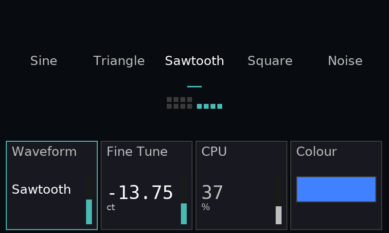
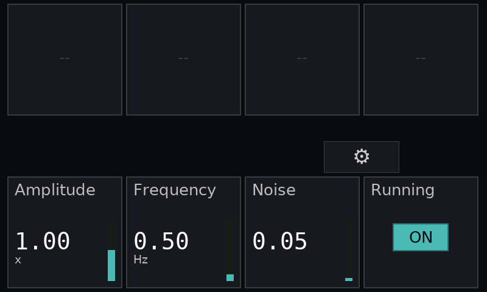
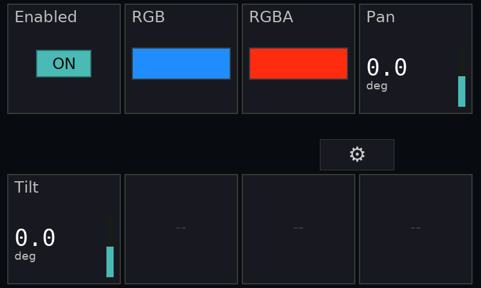

# Small-page ergonomics — 2026-09-07

Firmware application CRC32 `FC4AB010` was verified by USB readback after flashing.
Physical input numbering stays top-first. Generic pages with 1–4 populated fields
now use bottom knobs 4–7 (Dial 5–8), in left-to-right descriptor order. This includes
short final pages. Sparse IDs are packed only inside their original page, without
renumbering fields or changing SCREEN ranges. Pages with 5–8 fields keep normal
reading order. The opt-in Test Bench operator layout keeps its fixed action positions.

One mapping drives displayed cells, input routing, the inverse lookup for the digit
editor and miniature page maps. Unassigned top knobs cannot edit a hidden field;
opening a lower-row control uses the top row for its digit/choice/color editor.
Calibration settings and physical numbering are unchanged.

[Portable firmware tests](firmware-tests.txt) all passed. New cases cover every count
from 1 through 8, the 4/5 boundary, sparse fields across pages, inactive upper knobs,
bottom-knob edits with original wire IDs, and opposite-row drill/exit behavior.
The application build passed with the existing linker RWX warning and section-gap
warning; the verified image preserves the bootloader. The reproducibility patch
was checked against base `3c357964514460e19ad135160c02260b59dd2d79`.

Physical hand-operated encoder feel was not measured; automated tests exercise the
same input handlers, and framebuffer captures below verify physical-device rendering.

[Live four-app acceptance](gallery-acceptance.txt) passed after installation, including
value restoration, enum/vector/RGBA handling, 64-field paging and application handoff.
The captures are framebuffer readbacks from the attached Mini. No Portal motion was issued.
