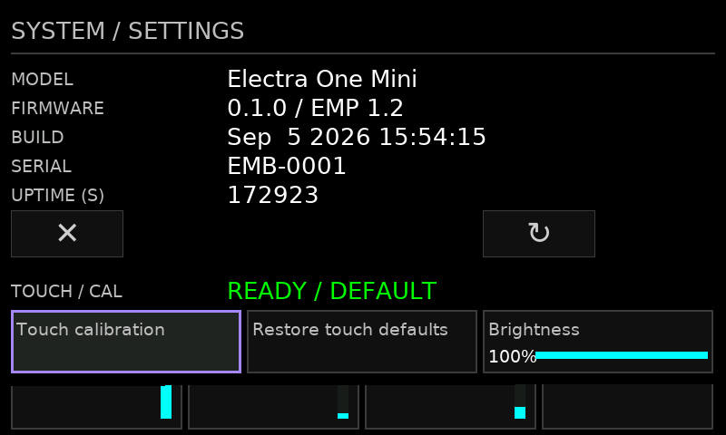
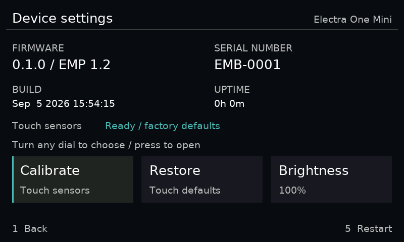
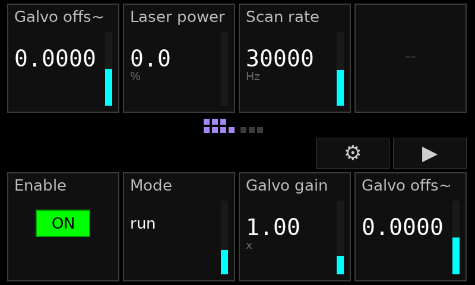
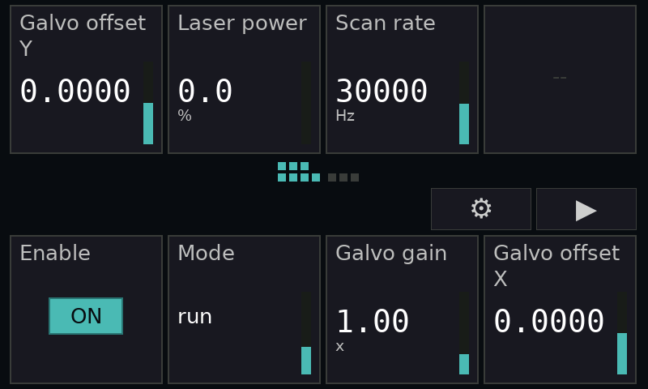
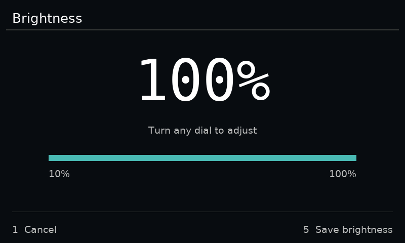
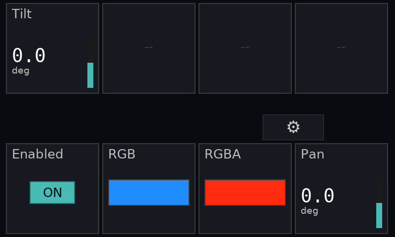

# Settings and Gallery validation — 2026-09-07

The attached Electra One Mini runs the updated application firmware (CRC32
`3F572EFA`, verified by readback). Device settings now use grouped facts, readable
cards and explicit navigation. Brightness has a large percentage and separate
range, instructions and save/cancel controls. Generic controls use two-line
labels, brighter units and the same restrained palette. The bootloader and EMP
wire format are unchanged by this pass; existing app layouts remain supported.

| Before | After |
| --- | --- |
|  |  |
|  |  |



These PNGs are actual device framebuffer readbacks, not mockups. The firmware's
compile-date label still reports September 5 because the build only recompiled
changed UI sources; the installed image is identified by the verified CRC above.

## Interaction fixes

- Host Reveal, descriptor replacement and disconnect preserve a local brightness
  or calibration editor. Back returns to the latest app. The new C regression
  exercises reveal/replace/clear during a brightness preview and checks Cancel.
- Gallery's delayed initial history response no longer overrides a tab selected
  while that response is pending. The new browser regression failed against the
  previous build and passes against the update.
- Scope exposed a host scheduling failure: a perpetually overdue telemetry timer
  was ahead of client input in a biased select loop. A browser hover was sent,
  but Scope's diagnostic `selected_scope` remained null. Telemetry now runs after
  control traffic; schema changes retain first priority. With 500 channels at
  60 Hz, repeated hover, parameter edit and reset now reach the hub. Scope also
  exposes the same diagnostic API as the Electra acceptance example.

## Live acceptance

All four examples were launched in native windows through Gallery and exercised
through their identical browser UI, using the shared daemon and physical Mini.

| Application | Checked |
| --- | --- |
| Console | Ten mapped controls, distinct X/Y labels, returning from other apps |
| Scope | 500 telemetry channels, hover after sustained load, amplitude round trip and restoration |
| Charts | Four shape controls and confirmed device page |
| Electra One | Enum value 90 maps to choice index 2, vector page reveal, RGBA, 64-field limit and final page |

The live test also held Console focus for ten seconds with the other applications
running, then returned to Scope and Charts. Background telemetry did not reclaim
the Mini. No page JavaScript errors were reported.

Repeat with those four examples running and the Mini attached:

```sh
cd PortalTestBench
node tools/test-gallery-surface.mjs
```

The test discovers the daemon from Scope's diagnostics. An explicit admin URL may
be supplied as its first argument. It restores the example values it edits and
never issues bench motion commands. See [the recorded output](acceptance.txt).




## Verification and limits

- Firmware portable suites: all passed, including local-editor preservation.
- Firmware application-bank build and USB CRC verification passed. The linker
  retains its existing RWX-segment warning; the image checker reports the expected
  inter-section gaps filled with `0xFF` by the flasher.
- Framework workspace build and TypeScript/Vite build passed.
- Host unit/integration tests: 34 passed, including schema-epoch ordering.
- Gallery Playwright tests: 6 passed against a fresh stateful fixture.
- Gallery and surface-focus unit tests: 15 passed.
- Live four-application test passed. Existing firmware tests cover device edit
  arithmetic, press edges and protocol behavior; physical hand-operated encoder
  feel and touch calibration were not measured in this session.

Portal Test Bench is running in simulation at http://127.0.0.1:8771, Gallery at
http://127.0.0.1:8740 and the current daemon admin at http://127.0.0.1:62109. Ports
for the daemon are discovered dynamically. Camera/video/GPU examples and Windows
were not part of this run. No real Portal motion was performed.
