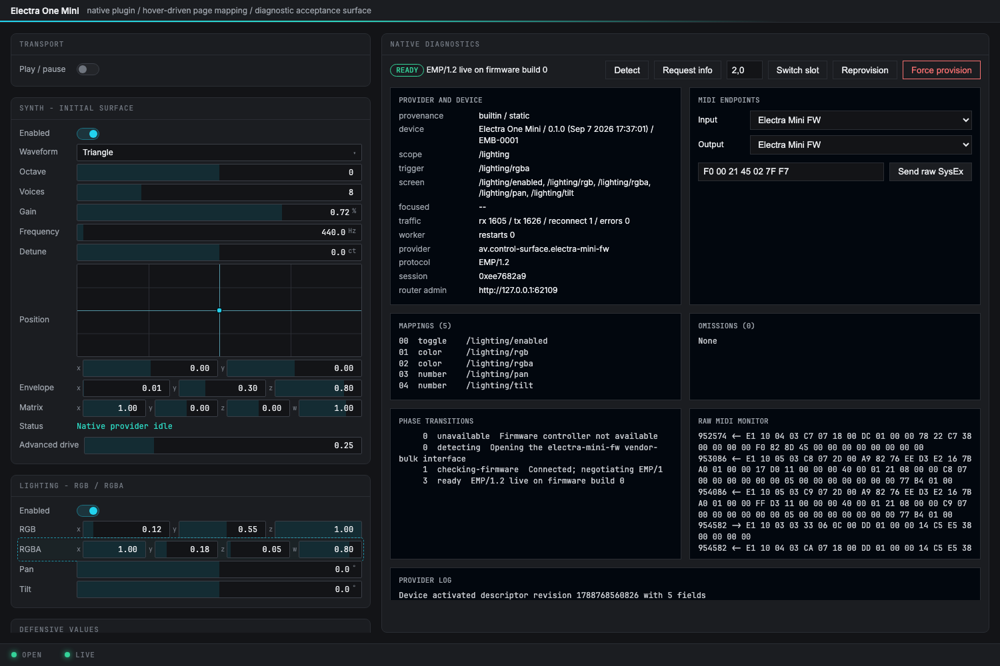
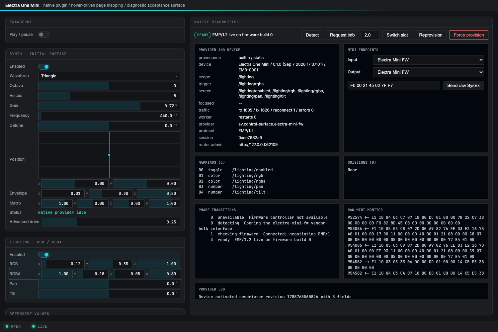
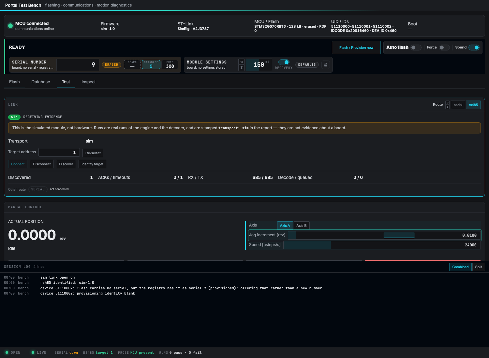

# Immediate control-surface hover — 2026-09-07

The desktop selection was coupled to device SCREEN reports and then throttled to
one DOM apply every 250 ms. The old generic telemetry limit had been applied to
interaction feedback. Row labels and padding also did not resolve to the row's
bound parameter, so they produced no focus request.

The shared web runtime now paints local intent before sending the request. A
subtle dashed outline means pending; a solid outline means that path is in the
controller's reported screen. Old screen highlights are suppressed while a new
target is pending. A reply for another path cannot move the requested target
backwards. Device acknowledgements are applied immediately. Single-parameter row
labels and padding share the control's hit area; ambiguous multi-parameter rows
still require an explicitly bound control. Disconnect and cleanup clear intent.

Highlight fill is now 4% cyan instead of 13%; pending uses 3%. Text colors are
unchanged, and the requested target uses a restrained one-pixel boundary. The
telemetry limit remains in place for readouts; the constraints document now
explicitly separates input feedback from telemetry.





## Measured evidence

- Before: outgoing focus requests followed mouseover in approximately 0.0–0.2 ms,
  but three of five briefly hovered targets never acquired their matching highlight
  before the next hover. The other two appeared about 97 ms after hover. See
  [the original browser trace](before-trace.json).
- After, same five-target trace: requested-state DOM mutations followed mouseover
  in 0.2–0.3 ms. See [the updated trace](after-trace.json). These are browser-side
  state-change timings, not physical display or native-window paint measurements.
- [The delayed-reply test](delayed-replies.txt) holds controller reports for 500 ms,
  crosses targets repeatedly, checks pending immediately after each hover, then
  releases queued reports and requires a matching confirmation. Its animation-frame
  observations were 0.3–24.2 ms. It also tests row padding with actual mouse movement.
- [29 focused web tests](web-tests.txt) passed: hover before transport send, stale
  replies, delayed replies, disconnect, cleanup, bus isolation, late mounts, existing
  lane touch highlights and stylesheet checks. Both framework and bench TypeScript/
  Vite builds passed. No Rust or firmware behavior changed in this pass.
- [Four-app live acceptance](gallery-acceptance.txt) passed after reloading the native
  examples: handoff, sustained telemetry, scalar/enum restoration, vector/RGBA,
  64-field paging and background-focus stability.

Repeat with the Electra One example running on 8745 and the attached Mini:

```sh
node PortalTestBench/tools/test-surface-hover.mjs /tmp/surface-hover
```

The browser regression deliberately delays only screen reports. It does not edit
parameters or issue motion. The native examples and Test Bench simulation window
were reloaded to pick up the rebuilt assets. Firmware stays at CRC `FF55D42E`.



[Final bench check](bench-check.txt): simulation on port 8771, controller ready,
manual page confirmed, daemon error count zero.
