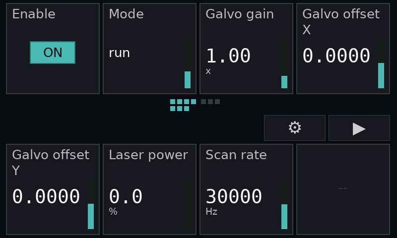
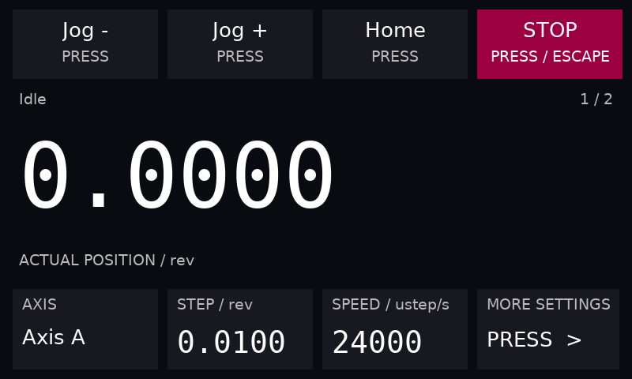
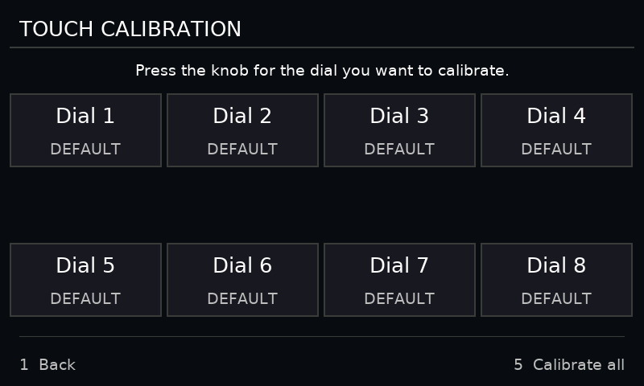
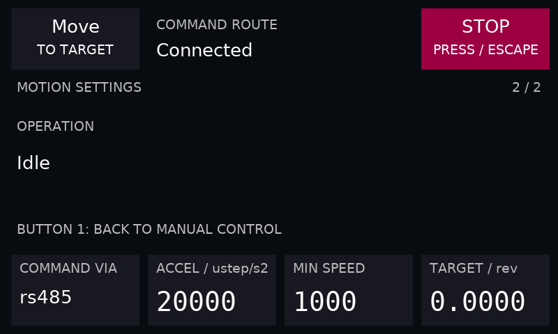

# Top-first firmware numbering — 2026-09-07

Installed application CRC32: `FF55D42E`, verified by USB readback. EMP remains 1.2;
no host or application update is required for generic top-first field placement.

Physical inputs 0–3 are top left-to-right; 4–7 are bottom left-to-right. Device
labels are Dial 1–4 and Dial 5–8 respectively. Rotation mux and inverse tables,
push indices, QT2120 key mapping, calibration selection, cell geometry, page map,
boot sequence and opposite-row digit editing use the same convention.

Version-1 saved calibration still uses its original physical-slot encoding.
Read/write conversion preserves masks, thresholds and gains across upgrades and
downgrades. Tests cover a partially calibrated legacy record and saving/reloading
a new top-left calibration. The opt-in operator layout keeps its existing semantic
slot contract: Jog/Home/Stop stay at the top, settings at the bottom. This layout
conversion is confined to firmware; generic apps have no row workaround.

Validation:

- [Portable firmware suites](firmware-tests.txt): all passed, including top-first
  generic pages, mirrored digit editing, operator Stop/More and calibration migration.
- ARM application build and image checks passed. Existing RWX linker warning and
  four-byte section gap remain; the flasher fills the gap and verifies the image.
- [Live Gallery acceptance](gallery-acceptance.txt): Console, Scope, Charts and
  Electra One passed; includes sustained telemetry, restored value/enum edits,
  vector/RGBA mapping, 64-field paging, background-focus stability and handoff.
- Device console injection of physical input 7 opens Test Bench settings; its
  screenshot confirms More remains bottom-right. Calibration selection was opened
  and closed without starting calibration.
- The source patch applies cleanly to firmware base `3c357964514460e19ad135160c02260b59dd2d79`.
- Physical hand-operated encoder/touch feel was not re-measured. Driver mappings
  follow the previously measured wiring tables with the former row conversion removed.
  Screenshots marked framebuffer readback are from the attached Mini, not mockups.

Test Bench was restored in simulation on port 8771. No real Portal motion was issued.
