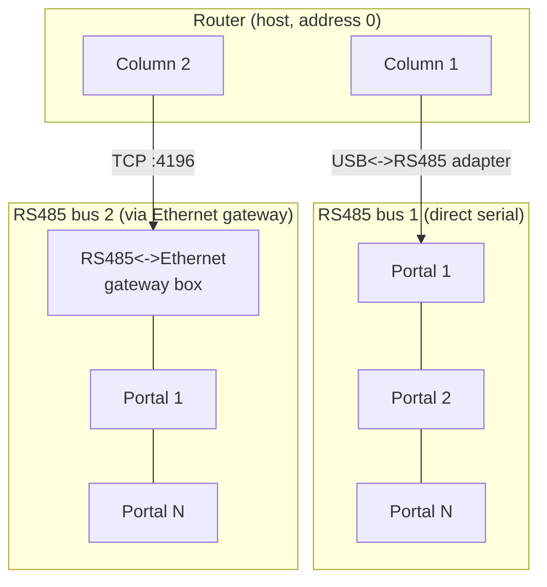
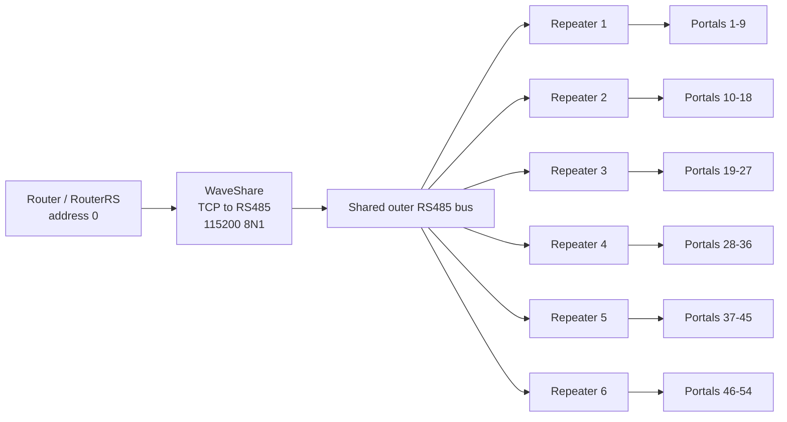
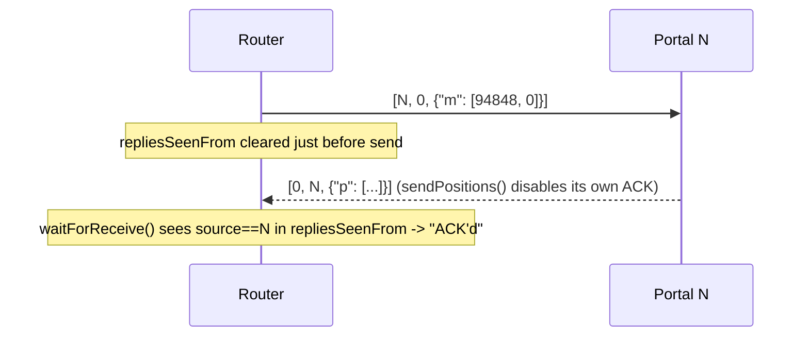
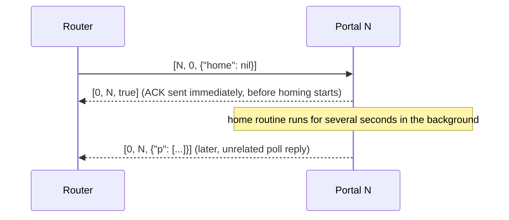
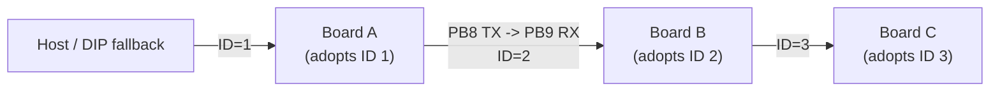
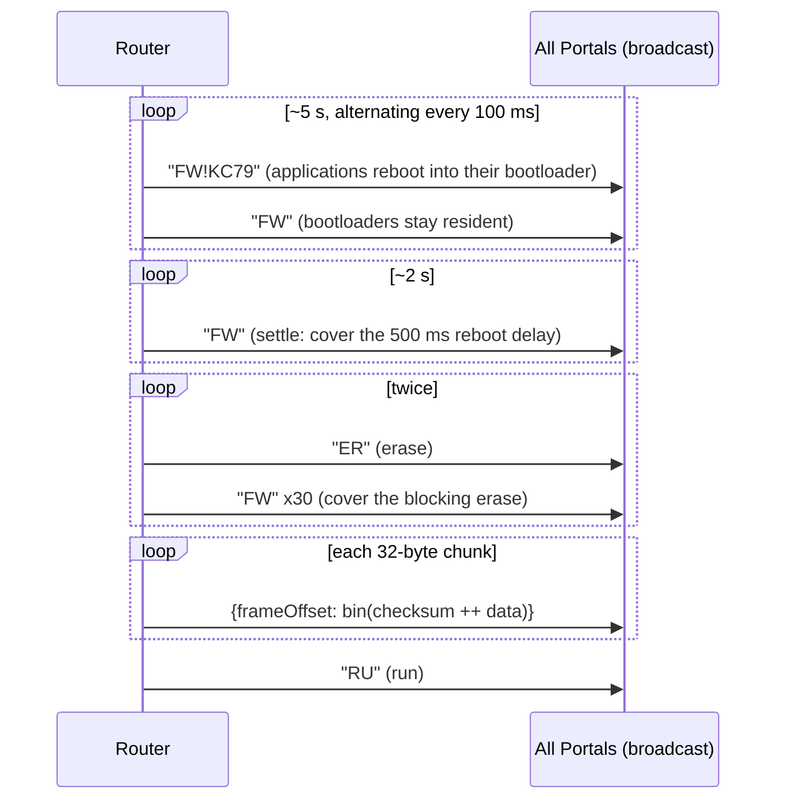
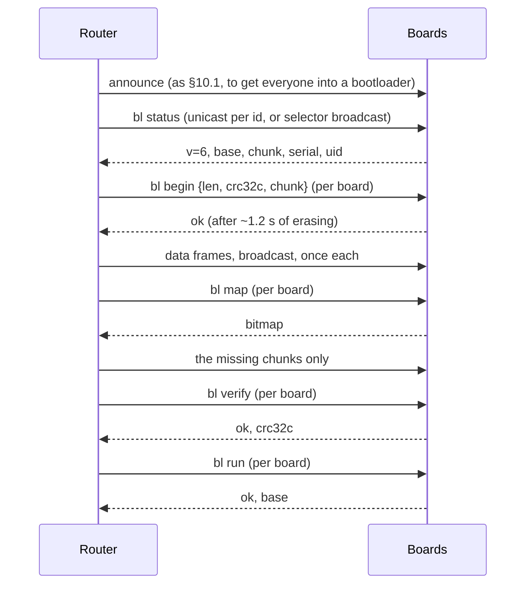

# KC79 Reworld — Communications Protocol

This document describes the wire protocol used between the **Router** (the
openFrameworks/C++ host application, also reimplemented in Rust as
`RouterRS`) and the **Portal** boards (STM32G070 microcontrollers, each
driving two prism-rotation motor axes).

It's written top-down: it starts with the simplest, most user-facing ways
to drive the system on both ends, then progressively zooms into
lower-level detail — the message vocabulary, the reliability contract, the
byte-level wire encoding, the physical bus — ending at the actual `RS485`
class source on both sides. You can stop reading as soon as you have the
level of detail you need; nothing later in the document is required to use
the system at the level described in [§1](#1-quick-start-simple-usage-patterns).

This document focuses on the RS485-based protocol itself — the wire
format between the Router and the Portals. The Router also exposes OSC
and REST network control surfaces built on top of it; those are covered
separately in [Appendix A](#appendix-a-osc--rest-control-surfaces) since
they're a layer above the protocol, not part of it.

Everything here describes the protocol **as currently implemented**. For a
list of known weaknesses and a proposed hardening plan (CRC, real
sequence-numbered ACKs, retransmission), see
[`protocol-hardening.md`](./protocol-hardening.md). Where relevant this
document notes the specific gap and links back to that plan rather than
repeating it.

Jargon is defined the first time it's used and again in the
[Glossary](#glossary) at the end.

---

## Table of contents

1. [Quick start: simple usage patterns](#1-quick-start-simple-usage-patterns)
2. [System overview](#2-system-overview)
3. [Commands & replies: the message vocabulary](#3-commands--replies-the-message-vocabulary)
4. [Reliability contract: ACKs, timeouts, collation](#4-reliability-contract-acks-timeouts-collation)
5. [Wire format: the MessagePack envelope](#5-wire-format-the-messagepack-envelope)
6. [Wire format: COBS framing](#6-wire-format-cobs-framing)
7. [Physical & electrical layer](#7-physical--electrical-layer)
8. [RS485 over Ethernet (the TCP gateway)](#8-rs485-over-ethernet-the-tcp-gateway)
9. [The ID daisy-chain](#9-the-id-daisy-chain)
10. [Firmware update / bootloader protocol](#10-firmware-update--bootloader-protocol)
    - [10.1 Compatibility mode](#101-compatibility-mode-the-broadcast-flow)
    - [10.2 The v6 control plane](#102-the-v6-control-plane)
    - [10.3 The handoff block](#103-the-handoff-block)
    - [10.4 The descriptor and the two bases](#104-the-application-descriptor-and-the-two-bases)
    - [10.5 Replacing the bootloader in band](#105-replacing-the-bootloader-itself-in-band)
    - [10.6 Updating a fleet](#106-updating-a-fleet)
11. [The repeater control plane](#11-the-repeater-control-plane)
12. [Repeater firmware update (OTA)](#12-repeater-firmware-update-ota)
13. [Known limitations](#13-known-limitations)
14. [Source map](#14-source-map)
15. [Glossary](#glossary)

**Appendix:** [OSC & REST control surfaces](#appendix-a-osc--rest-control-surfaces)

---

## 1. Quick start: simple usage patterns

You never need to touch COBS, MessagePack, or the `RS485` class directly to
use this system. Here's what actually gets used day-to-day, from the most
user-facing entry point down to the simplest C++/firmware calls.

(A **Column** is one RS485 bus with Portals `1..N` wired to it; addresses
are explained fully in [§2](#2-system-overview) — you don't need the full
model to follow the examples below.)

### Router side

**Simplest: the C++ API.** If you're writing Router code directly (a new
GUI button, a test harness, a headless script), you call plain methods on
a `Portal` object — no protocol code in sight:

```cpp
auto portal = column->getPortalByTargetID(8);

portal->ping();               // Portal.cpp:494 — sendToPortal(MsgPack(), "")
portal->poll();                // Portal.cpp:501 — requests a full status report
portal->performAction(action); // trigger any of the 12 broadcastable actions
                                // (ping, init, calibrate, home, flashLEDs,
                                // goHome, seeThrough, disableDebugLights,
                                // enableDebugLights, unjam,
                                // escapeFromRoutine, reboot)
```

None of this builds an envelope, encodes MessagePack, or waits for an ACK
by hand — `sendToPortal()` (§5) builds and queues the message, and a
background thread per Column (§4, §7) takes care of encoding, sending, and
waiting for the reply.

(The Router also exposes these same actions over OSC and REST for
network/operator control — see [Appendix A](#appendix-a-osc--rest-control-surfaces)
— but those sit on top of this C++ API and the RS485 protocol below it,
rather than being part of the protocol itself.)

### PortalFW side

**As a firmware developer, you almost never touch the protocol at all.**
The entire top-level loop is this (`PortalFW/src/main.cpp:59-64`):

```cpp
void loop() {
    app.update();
    HAL_Delay(1);
}
```

`App::update()` calls `rs485->update()` once per loop, alongside every
other module (`PortalFW/src/Modules/App.cpp:100`). Incoming frames are
decoded, dispatched to the right handler, and ACKed automatically — all
before any command-handling code you write ever runs.

**To add a brand-new command**, you add one branch to
`App::processIncomingByKey`. This is the entire cost of wiring up a new
command — reading a typed value and reacting to it
(`PortalFW/src/Modules/App.cpp:437-444`):

```cpp
else if (strcmp(key, "debugLightsEnabled") == 0) {
    bool value;
    if(!msgpack::readBool(stream, value)) return false;
    this->leds->setDebugLightsEnabled(value);
    return true;
}
```

No COBS, no framing, no ACK-sending code appears here — once your handler
returns `true`, `RS485::processIncoming()` (§4, §7) sends the ACK for you.

Everything from here on explains what's actually happening underneath
those calls, in progressively lower-level detail.

---

## 2. System overview

A physical installation is divided into **Columns**. Each Column owns exactly
one RS485 bus (or its Ethernet-gateway equivalent — see §8) and a number of
**Portals** — the boards physically wired to that bus, addressed `1..N`.
Address `0` is reserved for the Router itself ("the host"), and address `-1`
means **broadcast** (all Portals on the bus at once).



Every message on the wire — in either direction, on either transport — is
the same shape: a small binary **envelope** `[target, source, body]`,
**serialised** with **MessagePack** (a compact binary encoding, see §5), then
**framed** with **COBS** (Consistent Overhead Byte Stuffing, see §6) so a
receiver reading a raw byte stream off a UART can find message boundaries.
Address resolution, ACK matching, retries (or the current lack of them),
and the actual command semantics all live in a **reliability** layer built
on top of that (§4), which the OSC/REST/C++ calls in §1 sit on top of in
turn.

A separate, physically distinct link — not RS485, not COBS, not
MessagePack — chains the boards together only to hand out sequential
addresses at power-on; see §9.

### Installation topology versions

The original diagram above remains the topology for active **Reworld V1 and
V2** installations. Each Router Column talks directly to one Portal bus;
there is no ESP32 repeater, IDs begin at 1 on each Column, keyframe batches
default to 8, and the historical post-broadcast gap defaults to 100 ms.
Those defaults remain supported.

**Reworld V3** inserts six ESP32 repeaters between one shared outer RS485
channel and six isolated nine-Portal branches. IDs are globally unique on
that outer channel:



Each repeater calls the shared host-facing connection **side 1** and its
local Portal branch **side 2**. It stores a complete zero-delimited COBS
frame before forwarding it, so one frame uses one driver-enable interval.
Frames and queues are bounded: incomplete, oversized, or queue-overflowed
traffic is discarded as a complete unit and exposed in USB diagnostics;
partial commands are never forwarded.

Do not infer electrical polarity from an adapter's A/B labels: vendors use
conflicting A/B conventions, and a pair landed the wrong way round may be a
hardware fact an installation cannot change. Since 2026-08-26 the repeater
absorbs it: each side runs a polarity hunter (`auto` mode, the default) that
flips that UART's RXD/TXD inversion when traffic arrives only as UART errors,
locks once frames decode, and persists the proven value to NVS. A side can be
pinned `normal`/`inverted` as a documented installation override, over USB
(`polarity`) or in band (`set-polarity`, §11). `status` reports each side's
mode, current inversion, lock state and flip count; a side whose `flips` keeps
climbing without locking decodes at neither polarity, which is an electrical
fault, not a polarity choice.

At boot the repeater is transparent. A valid inner reply `[0, source, ...]`
teaches it which contiguous nine-ID block is local. It then forwards only
matching outer unicasts and keyframes whose `startIndex`/`values` interval
intersects that block. Unknown or malformed message types are fail-open,
and all inner replies continue toward the host. A valid inner reply from a
different block indicates an addressing or wiring conflict, disables
filtering, and leaves the unit transparent until reboot or the USB
`relearn` command.

V3 must opt into batches of nine and the bench-qualified broadcast gap in
its Router configuration. V1/V2 configurations should not add these
overrides. Both Router implementations accept the same settings:

```json
{
  "Installation": {
    "messaging": {
      "Keyframe batch size": 9
    },
    "columns": [
      {
        "Count X": 6,
        "Count Y": 9,
        "rs485": {
          "deviceType": "TCP",
          "address": "192.168.1.201",
          "port": 4196,
          "Gap between broadcast sends [ms]": 5
        }
      }
    ]
  }
}
```

`Count X` and `Count Y` must reflect the actual V3 image layout while their
product remains 54; the values above illustrate a 6 by 9 layout. Start at
5 ms in production. Values of 2, 1, and 0 ms are qualification settings,
not defaults, and require a full WaveShare/cable/54-Portal soak test.

The ESP32's independent USB CDC port accepts `status`, `version`,
`reset-counters`, and `relearn`. `status` reports the learned range, routing
mode, filtered counts, parse failures, UART errors, incomplete/oversized
frames, queue depths/high-water marks/drops, and transmission errors. A
healthy V3 branch is `filtered`, shows its assigned range, and retains zero
error/drop counters.

### Operating and commissioning a V3 repeater

The repeater is a frame router, not a transparent electrical amplifier. Its
fixed wire settings and pin names are:

| | Side 1 — shared host bus | Side 2 — local Portal branch |
|---|---|---|
| UART | ESP32-C3 UART0 | ESP32-C3 UART1 |
| Format | 115200 baud, 8N1 | 115200 baud, 8N1 |
| MAX3362 `RO` → ESP RX | GPIO20 | GPIO6 |
| ESP TX → MAX3362 `DI` | GPIO21 | GPIO4 |
| tied `DE`/`RE#` | GPIO7 | GPIO5 |
| polarity | decided on the wire (`auto`), persisted | decided on the wire (`auto`), persisted |

The tied `DE`/`RE#` signal is LOW while receiving and HIGH while
transmitting. The receiver output floats while transmitting, so firmware
biases each ESP RX pin to that UART's physical idle level. Each direction has
a four-frame queue, frames are limited to 8192 bytes, and an unterminated
stream is discarded after 2 ms idle. `reset-counters` preserves the learned
range; `relearn` clears it and returns routing to transparent mode.

Use this commissioning order:

1. Identify every serial device by USB VID/PID/serial or by a harmless
   identity query. Device paths and macOS `/dev/cu.usbmodem*` suffixes can
   change after every reconnect.
2. Disable local echo on the USB-RS485 adapter. Echoed request bytes are not a
   repeater or Portal reply.
3. Confirm the adapter uses automatic half-duplex direction control. The
   Router transports do not toggle a DE pin; an adapter that requires manual
   RTS direction must be configured to do that itself or is not compatible.
4. Query repeater USB `version`, verify v2.2.0 or later, 115200 baud, and each
   side's polarity state (`polarity`: mode, inverted, locked). Run
   `reset-counters`.
5. Send one known-good, non-motion frame at 115200/8N1 and wait for its reply
   before sending another. Do not begin with a burst discovery: a burst can
   fill the four-frame queue and obscure the electrical result.
6. Poll each expected local ID. A healthy branch learns the correct nine-ID
   block, returns one complete reply per request, leaves both queues empty,
   and records zero UART, incomplete, oversized, parse, queue-drop, topology,
   and TX errors.
7. Only after the branch passes should the full outer bus, nine-frame batches,
   5 ms production gap, and six-repeater/54-Portal soak be tested.

On the bench used for the 2026-08-24 investigation, the three simultaneously
attached serial functions looked like this. These paths are examples, not
stable configuration values:

| Example path | USB identity | Purpose / harmless identity query |
|---|---|---|
| `/dev/cu.usbserial-AR9366BD` | FTDI FT232R, serial `AR9366BD` | USB-RS485 wire transport; no text console |
| `/dev/cu.usbmodem21203` | ST-Link V2-1 VCOM | direct Portal ASCII serial; `v` prints the Portal version |
| `/dev/cu.usbmodem21401` | Espressif USB Serial/JTAG | repeater USB console; `version` returns JSON |

Never treat the programmer board's Portal VCOM as the USB-RS485 adapter. The
Portal VCOM bypasses the repeater and is useful for proving that a Portal
application or mechanical routine fails independently of RS485, but it does
not exercise either repeater side.

If valid frames do not arrive, separate UART-format diagnosis from electrical
diagnosis. All production participants use 115200/8N1: the repeater and
RouterRS select it explicitly, while PortalFW and legacy Router use their
UART libraries' 8N1 defaults. Check A−B and common-mode voltage at the actual
side-1 MAX3362 pins, not only at a connector; then check MAX3362 `RO` at ESP
GPIO20. During host transmission, tied `DE`/`RE#` must remain LOW. A clean
A−B waveform with malformed `RO` localises the fault to the MAX3362, enable,
or reference path. Clean `RO` with ESP UART errors localises it to ESP pin/UART
configuration. Neither normal nor inverted UART polarity producing a complete
frame is evidence against a simple A/B swap.

RS485 is differential but still has a permitted common-mode range. Provide the
designed signal reference unless both sides are intentionally galvanically
isolated; removing a ground conductor is not by itself a valid polarity or
noise fix. Scope or continuity-check both conductors, termination/bias, and
the reference before changing firmware. Session-specific captures, hashes,
and the unresolved 2026-08-24 bench result belong in
`RS485Repeater/FIELD_REPORT_2026-08-24.md`, not in the protocol contract.

---

## 3. Commands & replies: the message vocabulary

Every message body is one of the shapes below. This is the vocabulary the
higher-level calls in §1 ultimately produce — how it's actually encoded as
bytes is covered separately in §5.

| Body | Shape | Meaning |
|---|---|---|
| `nil` | bare nil value | **Ping** — elicits a bare ACK, nothing else. |
| a short string, e.g. `"FW"` | bare string | A **magic word** — see §10 (firmware update / reboot-to-bootloader). |
| bare `bool` | bare boolean | **ACK** — success/failure of the previous command. Not wrapped in a map — indistinguishable in shape from any other bare-value body (see §11). |
| `{"p": [a, b, ta, tb]}` | 1-entry map, value = 4 integers | **Position reply** — current position and target position for both axes. |
| `{"app":…, "mca":…, "mcb":…, "logger":…}` | up to 4-entry map | **Full status reply** to a `poll` — app uptime/version/calibration, per-axis motion-control health, recent log messages. |
| `{"poll": nil}` | 1-entry map | Request a full status reply. |
| `{"p": nil}` | 1-entry map | Request just a position reply (cheaper, higher-frequency poll). |
| `{"m": [a, b]}` | 1-entry map, array of 1–2 integers | Move both axes (or just one, if only one element given). |
| `{"motionControlA": {…}}` / `"motionControlB"` | nested map | Per-axis motion commands: `move`, `motionProfile`, `zeroCurrentPosition`, `measureBacklash`, `home`, `initTimer`, `deinitTimer`, `testTimer`. |
| `{"motorDriverA": {…}}` / `"motorDriverB"` | nested map | `testRoutine`, `testTimer`. |
| `{"motorDriverSettings": {…}}` | nested map | `setCurrent` (amps), `setMicrostepResolution` (log2 of the resolution, e.g. 32 → 5). |
| `{"init": …}` / `{"calibrate": …}` / `{"home": …}` / `{"unjam": …}` | value = `nil` (defaults) or array `[timeout_s, slowSpeed, backOffDistance, debounceDistance(, tryCount)]` | Long-running calibration routines — see the early-ACK note in §4. |
| `{"flashLED": …}` | value = `nil` or `[period_us, count]` | Blink the status LED, for physically identifying a board. |
| `{"debugLightsEnabled": bool}` | | Toggle debug LEDs (the handler shown in §1). |
| `{"escapeFromRoutine": nil}` | | Abort whatever long routine is currently running. |
| `{"reset": nil}` | | Reboot the application (not the bootloader — a normal `NVIC_SystemReset()`; contrast with the `"FW"` magic word in §10). |
| `{"keyframe": {"startIndex": n, "values": [...]}}` | nested map, array of `[a,b]` or `[a,b,va,vb]` | Batched pre-computed motion keyframes, broadcast; each device only consumes the slice matching its own ID. |
| `{"homeThreshold": n}` | | Optical home-switch threshold tuning. |

All of the above are dispatched generically: the firmware reads the body as
a map and, for each key, calls a handler looked up by that key name
(`App::processIncomingByKey`, `PortalFW/src/Modules/App.cpp` — see the
`debugLightsEnabled` example in §1). The `"id"` key is currently parsed but
not acted on by anything (`ID` doesn't implement a handler for it) — a stub
for future use, not a bug in current behaviour.

The **firmware-update sub-protocol** layers its own body shapes inside this
same envelope — see §10.

---

## 4. Reliability contract: ACKs, timeouts, collation

Each Column runs a single background thread
(`RS485::serialThreadedFunction`, `Router/src/Modules/Hardware/RS485.cpp:596-628`)
that repeatedly: checks for incoming bytes; if nothing has arrived recently
(`gapAfterLastRx_ms`, default **5 ms** — a settling gap to respect the bus's
half-duplex turnaround), sends the next queued outgoing packet.

### Sending and waiting for an ACK



After transmitting a packet that `needsACK` (the default), the Router waits
up to **`responseWindow_ms`** (default **300 ms**,
`Router/src/Modules/Hardware/RS485.h:128`) for *any* well-formed frame whose
`source` field matches the packet's `target`
(`waitForReceive`, `RS485.cpp:804-829`). If nothing arrives inside the
window, the send is logged as failed (if debug logging is on) — **there is
no retransmission**. If a matching-source frame does arrive, it's treated
as a successful ACK regardless of what its body actually contains — the
ACK's own `true`/`false` payload is never inspected by this matching logic,
and a late status or position reply can just as easily satisfy the wait as
a genuine ACK for that specific command. There is also no sequence number
anywhere in the envelope to correlate a specific reply with the specific
command it answers. All three of these are known gaps with a concrete fix
proposed — see
[Finding 3, protocol-hardening.md](./protocol-hardening.md#finding-3--ack-is-cosmetic-no-correlation-no-retransmission).

**Broadcast** packets (`target == -1`) never expect an ACK at all — both
sides agree on this: the firmware sets `disableACK = true` whenever it sees
target `-1` (`PortalFW/src/Modules/RS485.cpp:240-243`), and the Router's
`Column::broadcast()` sets `needsACK = false` on every packet it builds. A
broadcast is instead followed by a fixed pacing gap,
`gapBetweenBroadcastSends_ms` (default **100 ms**), before the next send is
attempted.

### Early ACK for long routines

`init`, `calibrate`, `home`, and `unjam` can run for seconds — far longer
than the 300 ms response window. To avoid the Router timing out on every
one of these, the firmware sends its ACK **immediately**, before starting
the routine (`RS485::sendACKEarly(true)`, called at the top of each of
those four handlers in `App.cpp`), then runs the (possibly long) routine in
the background. A `sentACKEarly` flag suppresses the normal end-of-message
ACK that would otherwise fire once `processCOBSPacket` returns, so exactly
one ACK is sent per command either way:



### Outbox collation

Before each send cycle, packets queued for the same `(address, target)`
pair are collapsed down to just the most recent one
(`RS485::collateOutboxPackets`, `RS485.cpp:479-525`, on by default). This
means if the GUI issues several rapid move commands to the same Portal
faster than the bus can drain them, only the latest target position is
ever actually sent — stale, superseded motion commands are silently
dropped rather than queuing up and executing out of order. Non-collateable
traffic (keyframe batches, firmware-upload frames) is exempt and always
sent in full.

---

## 5. Wire format: the MessagePack envelope

**MessagePack** is a compact binary serialisation format — think "JSON, but
each value is tagged with a type byte and packed to its minimal binary
representation" rather than printed as text. A small integer costs one
byte; a short string costs a length byte plus its bytes; there's no comma,
colon, or quote-character overhead. Type tags actually seen in this
protocol:

| Tag byte(s) | Meaning |
|---|---|
| `0x00`–`0x7F` | positive fixint (0–127) |
| `0xE0`–`0xFF` | negative fixint (-32 to -1); e.g. `0xFF` = -1 |
| `0x80`–`0x8F` | fixmap (0–15 entries) |
| `0x90`–`0x9F` | fixarray (0–15 entries) |
| `0xA0`–`0xBF` | fixstr (0–31 bytes), length encoded in the low bits |
| `0xC0` | nil |
| `0xC2` / `0xC3` | bool false / true |
| `0xC4` / `0xC5` | bin8 / bin16 (length-prefixed raw bytes) |
| `0xCA` | float32 |
| `0xCD` | uint16 |
| `0xCE` | uint32 |
| `0xD0` | int8 (used specifically for envelope addresses, see below) |
| `0xD2` | int32 |

### The envelope

Every message — command, reply, ping, or magic word — is a 3-element
**fixarray**: `[target, source, body]`.

- `target` (int): `0` = host/router, `1`–`127` = a specific Portal,
  `-1` = broadcast to all Portals on this Column's bus.
- `source` (int): who sent it (`0` from the Router; the sending Portal's
  own ID otherwise).
- `body`: the payload — the vocabulary catalogued in §3.

There are, in practice, **two different ways** the address pair gets
encoded, and both are accepted on decode:

1. **Minimal-int encoding** (`msgpack11`, used by most Router → Portal
   traffic, e.g. `Portal::sendToPortal`): addresses are packed to their
   smallest representation — a small positive target like `8` is a single
   positive-fixint byte `08`; `-1` is a single negative-fixint byte `FF`.
2. **Forced int8 encoding** (`msgpack-c`, used by `RS485::makeHeader` and
   the firmware-update path): addresses are *always* packed as a 2-byte
   `int8` (`0xD0` tag + value byte), e.g. target `-1` is `D0 FF`, not `FF`.

Firmware replies use yet another encoder (msgpack-arduino's
`writeInt8`/`writeIntU7`), which again may differ byte-for-byte from either
of the above.

Some frames carry two **extra elements** after the body: a sequence number and a
CRC-16 over everything before them, `[target, source, body, seq, crc16]`.
PortalFW appends them to every reply; the host appends them to every bootloader
control-plane request (§10.2). Both are forced-width encodings (`0xCC` + 1 byte,
`0xCD` + 2 bytes) specifically so the trailer is always the last five bytes and a
receiver never has to re-parse the body to find where it starts. Older readers
are unaffected — every decoder here requires only three elements and ignores the
rest, which is the tolerance that lets a hardened frame and a legacy frame share
a bus. None of this matters to a receiver: every decoder in this
project only requires the envelope to be *an array of at least 3 elements*
whose first two elements are integers of any width — extra trailing
elements are tolerated and ignored (this tolerance is deliberately relied
upon for forward-compatible protocol extension; see
[protocol-hardening.md §3](./protocol-hardening.md#3-proposed-end-state-wire-format)).

### Worked example: a broadcast poll

The Router asking every device to send a full status report is the body
`{"poll": nil}` addressed to target `-1` (broadcast), source `0` (host).
MessagePack-encoding just the body:

```
81 A4 70 6F 6C 6C C0
│  │  └────┬────┘ └── C0 = nil
│  └─ A4 = fixstr, length 4 → "poll" (70 6F 6C 6C = ASCII p o l l)
└──── 81 = fixmap, 1 entry
```

Wrapped in the 3-element envelope `[-1, 0, body]`:

```
93 FF 00 81 A4 70 6F 6C 6C C0
│  │  │  └──────────┬───────┘
│  │  └─ 00 = positive fixint 0  (source = host)
│  └──── FF = negative fixint -1 (target = broadcast)
└─────── 93 = fixarray, 3 elements
```

This 10-byte plaintext is what §6 turns into an actual wire frame.

### Worked example: a unicast move command

Body `{"m": [94848, 0]}` (move Portal 8's axis A to position 94848, axis B
to 0), addressed unicast:

```
Body:      81 A1 6D 92 CE 00 01 72 80 00
           │  │  │  │  └─────┬─────┘ └── 00 = fixint 0 (axis B target)
           │  │  │  └─────── CE = uint32 tag, value 94848 (axis A target)
           │  │  └────────── 92 = fixarray, 2 elements
           │  └───────────── A1 = fixstr length 1 → "m" (6D = ASCII 'm')
           └──────────────── 81 = fixmap, 1 entry

Envelope:  93 08 00 81 A1 6D 92 CE 00 01 72 80 00
           │  │  └── 00 = source (host)
           │  └───── 08 = target (Portal 8, positive fixint)
           └──────── 93 = fixarray, 3 elements
```

(matches `RouterRS/crates/router-proto/src/envelope.rs::unicast_move_frame_bytes`)

Both worked examples above are verified against the codec's own test
suite; §6 picks them back up and shows exactly what goes out on the wire.

---

## 6. Wire format: COBS framing

A UART is just a stream of bytes — it has no concept of "here's where one
message ends and the next begins." Something has to mark frame boundaries.
The obvious choice — a delimiter byte, e.g. `0x00` — only works if you can
guarantee that byte never occurs *inside* a frame's actual data. Since a
MessagePack-encoded body can legitimately contain `0x00` bytes (e.g. the
integer 0, or a null/`nil` value — as both worked examples in §5 do), we
need a way to remove all zero bytes from a message before sending it, in a
way a receiver can perfectly reverse.

**COBS (Consistent Overhead Byte Stuffing)** solves exactly this. It
transforms an arbitrary byte string into an equivalent one that is
guaranteed to contain **no zero bytes**, at a small, bounded overhead cost
(at most 1 extra byte per 254 input bytes). A single `0x00` byte can then be
appended as an unambiguous end-of-frame marker, and a receiver can always
find frame boundaries by scanning for `0x00`, and can safely resynchronise
after any corruption by just looking for the next one.

**The algorithm**, in short: scan the data for the position of each zero
byte. Replace each zero byte with a length code — the number of bytes until
the next zero (or end of data), plus one — so a decoder can reconstruct
where each zero *was* without that zero ever appearing on the wire. A
minimal worked example, straight from the vendored codec's own test
vectors (`Router/src/cobs-c/`, ported byte-for-byte in
`RouterRS/crates/router-proto/src/cobs.rs`):

```
input:   11 22 00 33
step 1:  find the zero at index 2. Bytes before it: 11 22 (2 bytes) →
         code = 2 + 1 = 03
step 2:  bytes after the zero to end-of-data: 33 (1 byte) →
         code = 1 + 1 = 02
encoded: 03 11 22 02 33
```

On this project's wire, a **frame** is: COBS-encoded MessagePack bytes,
followed by a single literal `0x00` delimiter
(`Router/src/Modules/Hardware/RS485.cpp:741-756`,
`PortalFW/lib/msgpack-arduino/.../COBSRWStream.cpp`). `0x00` is the *only*
byte with special meaning on the wire — everything else, including what
were originally zero bytes in the payload, has been transformed away.

### Worked example, continued: the broadcast poll

Taking the 10-byte plaintext from §5 (`93 FF 00 81 A4 70 6F 6C 6C C0`),
which contains exactly one zero byte (the source, at index 2):

```
plaintext:  93 FF 00 81 A4 70 6F 6C 6C C0
                    ^^ the one zero byte

before the zero: 93 FF        (2 bytes) → code 03
after the zero:  81 A4 70 6F 6C 6C C0  (7 bytes, end of data) → code 08

COBS-encoded: 03 93 FF 08 81 A4 70 6F 6C 6C C0
append EOP:   03 93 FF 08 81 A4 70 6F 6C 6C C0 00
```

That 12-byte sequence is exactly what goes out on the wire (verified
against the codec's own test suite,
`RouterRS/crates/router-proto/src/envelope.rs::broadcast_poll_frame_bytes`).
A receiver reads bytes until it sees `0x00`, hands everything before it
(`03 93 FF 08 81 A4 70 6F 6C 6C C0`) to the COBS decoder, and gets back the
original 10-byte plaintext.

The unicast-move envelope from §5 (13 bytes, with *two* embedded zero
bytes: the fixint `00` for axis B, and the high byte of `94848`) encodes to
`03 93 08 06 81 A1 6D 92 CE 04 01 72 80 01 00` — the same mechanism,
handling multiple zero bytes without any special-casing.

### On the receiving end

Both ends implement the mirror-image accumulate-until-zero logic:

- **Router** (`RS485::serialThreadReceive`,
  `Router/src/Modules/Hardware/RS485.cpp:631-711`): appends incoming bytes
  to a buffer; on a `0x00` byte, COBS-decodes the accumulated buffer, then
  MessagePack-decodes the result.
- **Firmware** (`COBSRWStream`,
  `PortalFW/lib/msgpack-arduino/src/msgpack/COBSRWStream.cpp`): this side is
  **streaming** rather than batch — it decodes bytes into a 256-byte ring
  buffer (`MSGPACK_COBSRWSTREAM_BUFFER_SIZE`,
  `COBSRWStream.hpp:4`) as they arrive, and the msgpack reader can start
  consuming fields before the frame's closing `0x00` has even been seen.
  This has a real consequence for data-integrity hardening — see
  [Finding 2 in protocol-hardening.md](./protocol-hardening.md#finding-2--no-payload-integrity-corruption-risk).

A **real captured frame** (a position report from device 1 to the host,
`[0, 1, {"p": [94848, 0, 94848, 0]}]`, position value `94848` = half a
prism rotation) demonstrates COBS handling of a payload with several
embedded zero bytes transparently:

```
03 93 D0 08 D0 01 81 A1 70 94 D2 05 01 72 80 D2 01 01 01 02 D2 05 01 72 80 D2 01 01 01 01 00
```

— which decodes, via the same procedure, to target `0` (host), source `1`
(Portal 1), body `{"p": [94848, 0, 94848, 0]}` (the position-reply shape
from §3).

---

## 7. Physical & electrical layer

**RS485** is a differential, multi-drop serial bus: two wires per pair
(commonly labelled **A** and **B**) plus the installation's designed signal
reference, connecting every node on the bus. Being differential (the signal
is the *voltage difference* between A and B) makes it far more resistant to
electrical noise over long cable runs than a single-ended bus like plain
UART/RS232, but each receiver still requires A and B to remain inside its
permitted common-mode range. A shared reference is therefore required unless
the transceiver link is intentionally galvanically isolated. Because all
nodes share the same pair of wires, RS485 is **half-duplex**: only one node may
drive (transmit on) the bus at any instant, or the signals collide. A bus like
this is normally **daisy-chained** node-to-node and terminated with a resistor at each
physical end of the cable run to prevent signal reflections; this project's
own bench-test notes call for "A/B/GND in a daisy-chain with proper
termination at the bus ends" — this is a physical/installation concern, not
something configured in software.

Underneath RS485 sits a plain **UART** (Universal Asynchronous
Receiver/Transmitter — the same kind of serial hardware used for RS232 or a
USB-serial adapter). Both ends run at:

- **Baud rate:** 115,200 (`Router/src/SerialDevices/IDevice.h`,
  `RouterRS/crates/router-link/src/rs485/device.rs`,
  `PortalFW/src/Modules/RS485.cpp`, and `RS485Repeater/src/main.cpp`)
- **Framing:** 8 data bits, no parity, 1 stop bit ("**8N1**"). RouterRS and
  the repeater select every field explicitly; PortalFW and legacy Router use
  their UART libraries' 8N1 defaults. No parity means single-bit-flip
  corruption is not detected at the UART level at all (see §11).

Because RS485 is half-duplex, each Portal must actively switch its
transceiver between "transmit" and "receive" mode — it cannot listen while
driving the bus. This is done with a **DE (Driver Enable) pin**: held LOW
the transceiver listens, held HIGH it drives. On the Portal board this is
GPIO `PA1` (`PortalFW/src/Modules/RS485.cpp:35`), toggled directly around
each transmission — this is the actual `RS485` class implementation this
whole document has been building up to:

```cpp
// PortalFW/src/Modules/RS485.cpp
void RS485::beginTransmission() { digitalWrite(PIN_DE, HIGH); }
void RS485::endTransmission()   { cobsStream.flush(); digitalWrite(PIN_DE, LOW); }
```

DE is raised before the first byte is written and only dropped back to
receive-mode *after* `flush()` has pushed every byte — including the
trailing COBS delimiter — out through the UART, so the bus is never
released mid-frame.

The Router side has **no DE-pin logic anywhere in software** — neither the
direct-serial transport (`Router/src/SerialDevices/Serial.cpp`) nor the TCP
gateway transport (§8) toggles a direction pin. This means the USB↔RS485
adapter (direct-serial case) or the physical RS485↔Ethernet gateway box
(TCP case) is relied upon to manage the electrical turnaround itself,
transparently to the application. Local echo must be disabled for normal
operation; otherwise the host can misclassify its own request bytes as an
incoming response. Static RTS/DTR levels are not a portable replacement for
automatic direction control.

### Pin summary (Portal board, STM32G070RBT6)

| Signal | Pin | Peripheral | Notes |
|---|---|---|---|
| RS485 TX | PA2 | USART2 | |
| RS485 RX | PA3 | USART2 | |
| RS485 DE | PA1 | GPIO | HIGH = transmit, LOW = receive |
| ID chain TX | PB8 | USART3 | separate bus, see §9 |
| ID chain RX | PB9 | USART3 | separate bus, see §9 |
| ID DIP switches | PD0–PD3 | GPIO, `INPUT_PULLUP` | fallback address, see §9 |

(Full pin map: `PortalFW/pins.md`.)

---

## 8. RS485 over Ethernet (the TCP gateway)

Some Columns reach their Portals not through a directly-attached USB↔RS485
adapter but through a **hardware RS485↔Ethernet gateway** — a small
external box that bridges a TCP socket to an RS485 differential pair
electrically. The Router talks to it as a plain TCP client
(`Router/src/SerialDevices/TCP.cpp`), on **port 4196** by default
(`TCP_DEFAULT_PORT`, `TCP.h:7`), with a 1-second connect timeout by default.
Two example gateway addresses are hardcoded as GUI quick-picks,
`192.168.1.201` and `192.168.1.202` (`TCP.cpp:124,142` — one per Column, in
practice), alongside a "Custom…" option for any `host:port`. No
vendor/model is named anywhere in the repository; only the port number and
those two example addresses hint that this is a typical industrial
serial-to-Ethernet bridge on a private LAN segment.

Both transports — direct serial and TCP — implement the same small
interface (`Router/src/SerialDevices/IDevice.h`):

```cpp
class IDevice {
public:
    virtual size_t transmit(const Buffer&) = 0;
    virtual bool   hasDataIncoming() = 0;
    virtual Buffer receiveBytes() = 0;
    // ...
};
```

Crucially, **the TCP path adds no framing of its own**. `TCP::transmit`
(`TCP.cpp:76-86`) calls `tcpClient.sendRawBytes(...)` on the buffer it's
given — which is already the fully COBS-encoded byte sequence, built
upstream by `RS485::serialThreadSend` exactly as for direct serial (§6).
`TCP::receiveBytes` (`TCP.cpp:96-110`) reads up to 256 raw bytes per call
and hands them back as-is; they may be a partial COBS frame, and are fed
into the same `cobsIncoming` accumulator used for the serial path.

In other words: **RS485-over-Ethernet, here, means "the same COBS/MessagePack
byte stream, tunnelled unmodified through a raw TCP socket to a hardware
gateway that re-emits it electrically as RS485."** TCP's own
ordering/retransmission guarantees mean bytes arrive complete and in order
across the network hop, but this only protects the Ethernet segment — the
RS485 segment on the far side of the gateway is exactly as reliable (or
unreliable) as the direct-serial case, since it's the identical protocol
running through it. The 300 ms response window, lack of sequence numbers,
etc. (§4) are unaffected by which transport a Column uses; the gateway is
invisible to everything above the `IDevice` abstraction.

---

## 9. The ID daisy-chain

Portal boards don't get their bus address from a central registry; the
address is derived by chaining boards together on a **separate,
point-to-point serial link** — not RS485, not COBS, not MessagePack — using
USART3 on pins `PB8` (TX) → `PB9` (RX). Board *N*'s TX physically wires to
board *N+1*'s RX, so the chain propagates address `N` down to address
`N+1`, one hop at a time:



**Wire format**, 5 bytes per message, terminated by a literal `0x00` (this
terminator is a bespoke framing scheme for this link only — it is *not*
COBS):

```
[ ID, 'C' XOR ID, 'R' XOR ID, 'C' XOR ID, 0x00 ]
```

Sent by every board once per second, or immediately whenever its own ID
changes (`ID::sendIDToNext`, `PortalFW/src/Modules/ID.cpp:140-149`):

```cpp
serialID.write(this->value);
serialID.write('C' ^ this->value);
serialID.write('R' ^ this->value);
serialID.write('C' ^ this->value);
serialID.write(0);
```

On receipt, a board buffers the last 4 non-zero bytes seen, and on a `0x00`
terminator with exactly 4 bytes buffered, checks the pattern and — if
it "matches" — adopts `receivedID + 1` as its own address
(`ID::readIncomingID`, `ID.cpp:106-137`), then forwards *its own new value*
(not the raw bytes it received) on to the next board. This is how "ID + 1,
forward" propagates down a chain: each board's outgoing message always
carries whatever it currently believes its own address to be.

If no valid signal is ever received on this chain, each board falls back to
a 4-bit binary value read from DIP switches `PD0`–`PD3` (active-low,
`INPUT_PULLUP`), offset by 1 so that all-switches-off maps to ID 1 (ID 0
is reserved for the host) — giving addresses 1–16 without the chain.

> **Note:** the checksum comparison in the current firmware has an
> operator-precedence bug (`^` binds looser than `==` in C++, so the
> intended `(targetID ^ 'C') == byte` check doesn't parse the way it reads)
> which means it accepts almost any 4-byte/terminator sequence rather than
> genuinely validating it, and the 4-byte receive buffer is never
> explicitly cleared after use. Both are called out with fixes in
> [protocol-hardening.md, Findings 1 & 5](./protocol-hardening.md#finding-1--id-daisy-chain-checksum-is-silently-disabled-correctness-bug).
> This document describes the mechanism as designed/implemented; it is not
> a description of the fix.

---

## 10. Firmware update / bootloader protocol

Two protocols share this wire, and a board may speak either. Which one it speaks
is a property of the **bootloader** burned into it:

- **v4/v5**, in every board not yet updated: broadcast-only, silent, strictly
  sequential. [§10.1](#101-compatibility-mode-the-broadcast-flow) describes it.
  A v6 bootloader still accepts all of it.
- **v6**: addressed, answers, and can be asked what it actually received.
  [§10.2](#102-the-v6-control-plane) onward.

A fleet contains both for as long as it takes to update it, so a host has to
discover which it is talking to rather than assume.

### 10.0 Why v6 exists

The v4/v5 bootloader's erase covered three pages more than the application bank.
Those three pages hold the board's provisioning serial number and both settings
journals, so **every field update destroyed the board's identity** — silently,
because the update itself succeeded and the loss only surfaced later.

Fixing that needed a new bootloader, and since a bootloader is replaced rarely,
everything else worth fixing was fixed with it. The consequential changes for a
host author:

| | v4/v5 | v6 |
|---|---|---|
| durable pages | erased on every update | never touched |
| addressing | broadcast only | unicast, or broadcast with a selector |
| replies | none | every request answered, sequence-numbered |
| a lost frame | ends the upload; host reports success | reported by a bitmap, repaired |
| frame order | strictly increasing | any order; duplicates free |
| reception during erase | deaf for over a second | continuous |
| application base | `0x08006000` | `0x08004000` (the bootloader is 8 kB smaller) |

### 10.1 Compatibility mode: the broadcast flow

Unchanged, and what an un-updated Router sends. All broadcast (`target = -1`),
none of it acknowledged.



**The two announce words are interleaved, not sequential**, and this is the part
most easily got wrong. A running application acts only on the 7-byte
`"FW!KC79"`; a v4/v5 bootloader cannot parse that word at all — it reads an
announce into a 3-byte buffer, so seven bytes is a format error — and acts only
on `"FW"`. A phase carrying just the long word therefore puts a board in a loop:
the application reboots into a bootloader that hears three seconds of nothing it
understands, times out, and jumps straight back into the application. Whether a
given board is resident when the short word finally starts is a race on its own
phase, and a board that loses it sits out the whole update while the host
reports success.

| Word | Bytes | Meaning |
|---|---|---|
| `"FW!KC79"` | `A7 46 57 21 4B 43 37 39` | A running application resets into its bootloader. |
| `"FW"` | `A2 46 57` | Keepalive. On v4/v5 it also resets upload progress; **on v6 it does not** — a host holding other boards resident must not be able to discard this one's session. |
| `"ER"` | `A2 45 52` | Erase the application bank. |
| `"RU"` | `A2 52 55` | Start the application. |

Full envelope bytes for `"FW"` (forced-int8 header): `93 D0 FF D0 00 A2 46 57`.

**Upload frames** carry the image in fixed-size chunks (32 bytes by default,
`FW_FRAME_SIZE`), each a 1-entry map keyed by byte offset, value a `bin` of
`checksum (2 bytes, little-endian) ++ data`:

```
{ frameOffset(uint32) : bin( checksum_le(u16) ‖ raw_data ) }
```

The checksum is an XOR of every 16-bit little-endian word in the chunk
(`Utils::calcCheckSum`, `router_proto::fw::checksum_xor16`) — a payload-only
check that says nothing about the offset key it arrived with. Example, for a
32-byte all-`0xAA` chunk at offset 64:

```
93 D0 FF D0 00                  -- [-1, 0, ...] envelope (broadcast, forced-int8)
81 40                            -- fixmap(1), key = 64 (fixint)
C4 22                            -- bin8, length 34 (2 checksum + 32 data)
00 00                            -- checksum: 16x 0xAAAA XORed together = 0 (even count)
AA AA AA ... (32 bytes)          -- the data itself
```

Offsets are 32-bit the whole way; the folklore that a 16-bit field limited image
size traced to a different bug entirely (`protocol-hardening.md` §7.4).

**On v6, this flow writes at the legacy base `0x08006000`** — a host old enough
to send `"ER"` is sending an image linked for it. The erase still covers the
whole `0x08004000`–`0x0801E800` bank, so a stale new-base image cannot shadow
the one just uploaded.

On Reworld V3 the repeaters do not filter or reinterpret any of this: every word
and every upload frame is relayed down the chain as received, at the same 115200
baud. Use the firmware updater's own pacing; the 5 ms V3 broadcast gap does not
override a packet's explicit wait. That pacing is only real if each frame has
left the port before the gap starts: RouterRS drains the port (`tcdrain`) after
every write, because a host that merely sleeps after `write()` fills the OS
buffer within seconds and from then on the adapter's FIFO runs dry mid-frame and
its driver-enable drops — invisible on a pair at the receiver's polarity, fatal
on one the repeater is absorbing by inversion (§2).

Because the panels are chained rather than starred, a frame is stored and
forwarded once per panel, so its delivery time grows with depth — roughly
`(hops + 1) x` its own wire time. A 146-byte data frame is about 12.7 ms on the
wire, so a fourteen-panel chain puts the last panel's copy some 180 ms behind the
host's. That is latency, not throughput: every segment runs at the same rate, so
a host pacing below the line rate keeps every queue shallow. It is why the reply
timeouts in `router_link::fw_session` are set in hundreds of milliseconds rather
than tens.

### 10.2 The v6 control plane

Body key `"bl"`, carried in the ordinary envelope with a trailer:

```text
host -> board : [id | -1, 0, {"bl": {"q": "<verb>", ...}}, seq, crc16]
board -> host : [0, id,      {"bl": {"q": "<verb>", ...}}, seq, crc16]
```

`seq` is echoed, so a reply can be matched to the request it answers — the
correlation ordinary command traffic still lacks (§13). The trailer is the same
`[seq_u8, crc16_u16]` PortalFW already appends to its replies (§5): forced
widths, always the last five bytes, CRC-16/CCITT-FALSE over everything before
it. A frame whose trailer does not verify is dropped without a reply.

#### Who answers

Half-duplex, so exactly one board may answer one frame.

- **Unicast** to a board's id: answered.
- **Broadcast with a selector** — `"s": <serial>` or `"uid": bin(12)` — answered
  only by the board that matches. This is the escape hatch that matters: a board
  that power-cycled has no application to tell its bootloader its id, so the
  serial in its identity page is the only way to single it out.
- **Broadcast without a selector**: acted on by every board, answered by none.
  That is how one `begin` opens a session on fifty-four boards at once. `adopt`
  is the exception — it is ignored, since every board taking the same id is how
  a bus becomes unusable.

#### Verbs

| Verb | Request | Reply |
|---|---|---|
| `status` | — | `v`, `id`, `src`, `s`, `uid`, `base`, `cap`, `chunk`, `st`, `prog`, `wp`, `n`, `err`, `app:{base, ver}` |
| `begin` | `len`, `crc` (CRC-32C), `chunk`, `base?` | `ok`, `err?` — **after the erase completes** |
| `map` | `chunk?` | `chunk`, `len`, `map: bin` |
| `verify` | — | `ok`, `crc`, `len` |
| `run` | — | `ok`, `err?`, `base` |
| `adopt` | `id` | `id` |
| `reset` | — | `ok`, then resets |

`begin` erases the whole application bank one page per loop pass and answers
when the last page is done — about 1.2 s. **Allow at least 3 s.** Answering only
then is the point: the host waits for a fact instead of blanketing the erase in
announce frames and hoping, as it must with v4/v5.

`v` is the capability gate. A host must read `status` before using any other
verb, and must degrade **per board** rather than fleet-wide.

`src` says where the board's address came from — `"handoff"`, `"adopt"` or
`"dip"`. A DIP-derived address is a fallback that several boards on a branch may
share, so a host that sees `"dip"` should prefer a serial selector.

`st` is `0` idle, `1` erasing, `2` receiving, `3` held (nothing valid to run, or
a session open). `err` is a numeric code; the names are in
`router_proto::bootloader::error_name`.

The `map` bitmap has bit *i* set when chunk *i* arrived **in full**, LSB-first
within each byte — the same convention as the repeater's OTA bitmap (§12), so a
host can share one repair loop. A partially-received chunk reads as missing, so
the host resends the whole thing rather than leaving a hole it has been told is
filled. A full 106 kB bank at 256-byte chunks is 53 bytes of bitmap.

#### A v6 update, end to end



The image is transmitted **once** regardless of how many boards are being
updated, and only the gaps are repaired. Contrast §10.1, where the only recovery
available is to send everything several times.

### 10.3 The handoff block

A bootloader has no address of its own: the RS485 id is assigned by the
daisy-chain (§9), which the *application* runs. So before resetting into the
bootloader, the application leaves a note — 32 bytes at `0x20008FE0`, the top of
SRAM, excluded from both images' linker RAM so neither stack can reach it and
startup neither copies nor zeroes it.

```
+0x00 u32  magic       0x4839374B ("K79H")
+0x04 u8   version     1
+0x05 u8   request     0 none, 1 stay in the bootloader, 2 run now (internal)
+0x06 i8   id          RS485 address, <= 0 when unknown
+0x07 u8   flags       bit 0: the serial field is valid
+0x08 u32  serial      provisioning serial
+0x0C u32  arg0        for request 2: the base to start
+0x10 u32  reserved[3]
+0x1C u32  crc32c      over bytes 0..27
```

The CRC is not decoration: this RAM holds whatever the last program left there,
and a stale pattern resembling the magic would give a board a wrong bus address.

`request = 1` also buys a **30-second** residency instead of the 3 seconds a
board waits after an ordinary power-on — which removes the race the old host had
to paper over by shouting announce frames for the entire update.

### 10.4 The application descriptor, and the two bases

Bootloader v6 is 16 kB rather than 24 kB, so the application moves from
`0x08006000` to `0x08004000` and gains 8 kB. Both bases are current for as long
as any board still runs an old bootloader.

The two images are **indistinguishable by inspection**: the banks overlap, so
both have a stack pointer in SRAM and a Thumb reset vector inside the
application region, and starting the wrong one does not fail at the jump — it
hard-faults later at an unrelated absolute address. So an image states its own
base, in a 56-byte descriptor at `base + 0xC0` (immediately past the G070's
46-entry vector table):

```
+0x00 char[8]   "KC79APP1"
+0x08 u32       app_base
+0x0C u32       flags
+0x10 char[40]  version string, NUL-padded
```

The bootloader refuses to start an image at `0x08004000` that carries no
descriptor, or whose descriptor names a different base. Host tooling refuses to
*send* one to a board that would not run it.

The legacy base is tried only when the new bank is **entirely blank** — the
state a board is in between having its bootloader replaced and its application
re-uploaded. Without that fallback, updating a fleet would be a flag day. An
image built before descriptors existed has none, and is legacy-base by
definition.

### 10.5 Replacing the bootloader itself, in band

A bootloader cannot rewrite itself — erasing the page it is executing from
stalls the fetch that would bring back the next instruction. Until v6 that meant
a debug probe, physically, one board at a time.

The other path is the *application*: it receives a bootloader image over the bus
into RAM, checks it, and then as the last thing it ever does rewrites the
bootloader bank and resets. Unicast and ACKed, under the body key `"blimg"`:

| Request | Meaning |
|---|---|
| `{"blimg": {"begin": [len, crc32c]}}` | declare a transfer; `len` ≤ 16 kB and a multiple of 8 |
| `{"blimg": {"data": [offset, bin]}}` | one 128-byte chunk |
| `{"blimg": {"commit": [stay]}}` | check everything, then install and reset |
| `{"blimg": {"abort": nil}}` | discard |
| `{"blimg": {"q": nil}}` | reply `{"blimg": {"st", "len", "n"}}` — for resuming |

`commit` refuses unless every chunk arrived, the CRC-32C matches, the vector
table is plausible, the image contains the `Bootloader v` banner, and no motion
routine is running. It is also gated on the frame's own CRC-16: it is the one
command in the application that is irreversible.

> **There is a window of roughly half a second** between the first erase and the
> last verified write during which the board has no bootloader. A power loss
> inside it leaves a board that needs a debug probe. Nothing can remove that;
> the checks above exist to make sure it is only ever entered with an image that
> is already known to be good.

Interrupts stay enabled throughout — flash operations stall the bus rather than
faulting, and the erase wait needs SysTick — and the watchdog is fed from inside
the loop rather than around it.

### 10.6 Updating a fleet

For a board running an old bootloader and an old application:

1. **Legacy upload of the transition application** (`*_legacy_base`, linked at
   `0x08006000`), through §10.1. It carries the handoff writer, the descriptor
   and `"blimg"`. Confirm with a `poll`.
2. **Replace the bootloader in band**, per board, via §10.5. About three seconds
   each. The board resets into v6, which finds the new bank blank and starts the
   transition application still sitting at the legacy base — nothing visible
   changes.
3. **One v6 fleet session** with the new-base application (§10.2). Every board
   now answers `status`, so the image goes out once and only the gaps are
   repaired.

Steps 2 and 3 can be combined per board with `commit`'s `stay` flag.

---

## 11. The repeater control plane

Everything in §1–§10 treats the V3 repeaters as invisible: they relay frames and
have no address of their own. This section adds a second, disjoint plane on the
same wire so a repeater can be queried, configured and diagnosed from the host,
without any change to how Portal traffic behaves.

```text
host     -> repeater : [0, 0,    {"rq": {"a": <addr>, "q": "<verb>", "v": <payload>}}]
repeater -> host     : [0, addr, {"rr": {"a": <addr>, "q": "<verb>", "ok": <bool>, "v": <payload>}}]
```

### Why the envelope target is 0

The obvious design gives each repeater a negative address in the envelope's
`target` field, where Portal IDs are always positive. It decodes correctly
everywhere — but it is the wrong choice, for one reason found by tracing what a
repeater running **v2.2.0** does with such a frame.

`FrameRouter::shouldForward` has exactly one unconditional filter: a side-1 frame
whose `target` is `0` is dropped before the routing mode is even consulted. An
*unrecognised* target instead falls through to a fail-open `return true`. So an
un-updated repeater would relay every repeater-plane frame onto its nine-Portal
branch — harmless for a 30-byte status query, ruinous for a 300 kB firmware image
being unicast to a different repeater on the same shared bus.

Carrying the repeater address in the **body** and leaving the envelope target at
`0` inverts that: a v2.2.0 repeater counts the frame as `filteredHostFrames` and
never touches its branch, with no firmware deployed first. Portals and the frozen
STM32 bootloader never see these frames at all, so an OTA chunk never exercises
the bootloader's 64-byte COBS decode buffer.

### Addresses

| `a` | Meaning |
|---|---|
| `-2` | every repeater (`REPEATER_ALL`) |
| `-3` … `-8` | repeaters 1 … 6 |
| `bin(6)` | one repeater by MAC, regardless of its index |

Repeater *N* serves Portal IDs `9(N-1)+1 … 9(N-1)+9`. The values can never collide
with a Portal ID (always positive), with `BROADCAST` (`-1`), or with `HOST` (`0`).

A repeater's index lives in NVS and is **not** derived from its learned range. A
repeater whose branch is dead never learns a range, and that is precisely when
remote access matters most, so MAC addressing is the escape hatch. An
unprovisioned unit answers as `-2` and identifies itself by the MAC in its status
payload.

**Any verb that solicits a reply is unicast-only**, enforced in firmware: six
repeaters answering one broadcast would collide on a half-duplex multidrop bus.
Only `snap-start`, `ota-data`, `ota-boot` and `ota-abort` may be broadcast.

### Verbs

| Verb | Payload | Reply |
|---|---|---|
| `status` | — | full health map (below) |
| `relearn` | — | ack; clears the persisted range too |
| `reset-counters` | — | ack; preserves the learned range |
| `reboot` | — | ack, then resets after 250 ms |
| `set-index` | `int` 0–6 | ack; usually MAC-addressed |
| `snap-start` | `int` collect ms (optional) | none — broadcast |
| `snap-read` | — | the branch's stored replies, then a summary |
| `set-polarity` | `[side, mode]` — side 1\|2, mode 0 normal / 1 inverted / 2 auto | ack |
| `ota-*` | see §12 | see §12 |

The `status` payload reports `proto` (control-plane version), `dehw` (whether
the UART peripheral times driver-enable), `ver`, `build`, `mac`, `idx`, `mode`,
`range`, per-side counters under `s1`/`s2` — including `vf` (frames that parsed),
`ph` (phantom delimiters skipped), and the polarity fields `inv`/`pol`/`lk`/`flp`
— filter counts
under `flt`, plane counters under `plane`, a monotonic `ev` event counter, and a
`health` map carrying `rst` (reset reason), `boots`, `unhealthy`, `heap`, `up`
(64-bit uptime — `millis()` wraps every 49.7 days and this installation runs for
months) and `cd` (a core dump is waiting in flash).

`proto` is the capability gate. A host must read it before using the snapshot or
OTA verbs, and must degrade **per repeater** — falling back to unicast polling for
that one nine-ID block — rather than fleet-wide.

`ev` increments on every state change worth knowing about, so a host that only
samples occasionally can tell it missed something between polls instead of seeing
a steady picture.

### Aggregate position snapshot

The one two-stage protocol `reports/esp32-rs485-router-efficacy.html` endorses.

1. The host broadcasts `snap-start`. All six repeaters begin polling their own nine
   Portals with `{"p": nil}` — the branches are electrically isolated, so those
   sweeps genuinely run in parallel.
2. The host then unicasts `snap-read` to each repeater in turn.
3. Each answers by relaying its stored Portal replies **verbatim**, followed by one
   summary frame carrying `start`, `count`, a `mask` of which IDs answered, and the
   measured sweep time.

Relaying raw frames rather than repacking them costs about a hundred extra bytes
per branch and buys two things: the host needs no new parser, since each relayed
frame reaches the same per-Portal path a directly-polled reply does, and PortalFW's
own `[…, seq, crc16]` trailer survives end to end instead of being discarded and
replaced with nothing.

The host stays the single arbiter of the bus throughout. An earlier design gave
each repeater a fixed time slot; that was dropped because the host has no way to
stay quiet during one — `gap_after_last_rx_ms` is 5 ms and it knows nothing about
snapshots — and because a store-and-forward write can block a repeater's loop for
tens of milliseconds, skewing its idea of when its slot started.

Budget: about 60 ms of parallel collection plus six reads of roughly 28 ms each,
so **≈220 ms** for 54 Portals against ≈540 ms for 54 unicast polls — about 2.4×.

During a sweep the repeater claims **only** the reply to the poll currently
outstanding. A log message, a late reply from an earlier sweep, or a duplicate is
relayed upstream as usual, so the repeater does not go blind to branch faults for
the length of every sweep. A reply that arrives after the collect window is
forwarded *and* its ID appears as missing in the mask; a host reconciler must
tolerate seeing both.

---

## 12. Repeater firmware update (OTA)

Structurally unlike §10, because the receiver is better. The Portal bootloader
requires strictly sequential offsets and cannot report a loss, so the host
compensates with blind repetition. A repeater records which chunks it actually
received, so the host sends the image once and repairs exactly the gaps.

No repartition is needed. The deployed units already carry Arduino's stock
`default.csv` — `app0`/`app1` of 0x140000 each plus `otadata` — and a v3.0.0 image
is about 24% of one slot. Once v3.0.0 is installed over USB one time, every later
update is in-band.

### Sequence

| Step | Address | Notes |
|---|---|---|
| `ota-begin` | unicast | `{"size", "chunk", "session", "sha"}`. **Acknowledged.** |
| `ota-data` | unicast or broadcast | `[session, index, bin(data), crc16]`. Unacknowledged. |
| `ota-map` | unicast | replies with the raw received-chunk bitmap |
| `ota-data` | unicast | repair pass for the gaps the bitmap named |
| `ota-end` | unicast | SHA-256 check by read-back, then commit |
| `ota-boot` | unicast or broadcast | reboot into the new slot |
| `ota-confirm` | unicast | optional; accelerates the pending-verify decision |
| `ota-abort` | unicast or broadcast | abandons a session and resumes relaying at once |

**`ota-begin` must be acknowledged before anything is streamed.** It erases the
slot, and `CONFIG_UART_ISR_IN_IRAM` is not set in the pinned framework — which
ships as prebuilt static libraries, so it cannot be enabled. The UART RX ISR lives
in flash and cannot run while the cache is disabled for an erase. Against a 128-byte
FIFO (11.1 ms at 115200) and a 30–45 ms sector erase, inbound bytes are lost for
hundreds of milliseconds. Answering only after the erase returns puts that loss
inside a window the host is already waiting in.

**Every chunk carries the session**, not just `ota-begin`: otherwise a repeater that
missed the end of transfer A would write transfer B's chunks into A's half-populated
slot and fail verification for a reason nobody could see.

**The bitmap is sent raw**, not as run-lengths — a fixed 78 bytes for a 617-chunk
image, where a worst-case alternating gap pattern would make run-lengths 1.6 kB on
a bus where every other repeater has to buffer them. The host computes the runs.

**Chunk 0 goes first in every pass**, including repair, so the receiver's first
write into a freshly erased slot always carries the image header.

**Relaying is paused for the duration of a session**, and resumes automatically
after 30 seconds of silence. The control plane keeps working while paused — that is
what lets a paused repeater be told to resume — but an abandoned session that left
the bridge down forever would mean a ladder.

Rolling unicast is the default; broadcast is an operator-gated maintenance mode,
because it pauses all six bridges at once and blacks out the whole installation.

**Timing, honestly:** 315,904 bytes plus framing is about 340 kB on the wire, so
**≈33 s per repeater** at 115200 — roughly 3.5 minutes for a rolling fleet update,
or 45–90 s for a broadcast pass with repair. Do not schedule a 45-second window.

### Rollback

The repeater keys its rollback decision on **local evidence of malfunction**, never
on the absence of evidence of health, and the sketch overrides Arduino's weak
`verifyRollbackLater()` so the decision belongs to the application rather than to
`initArduino()`.

- **Boot-loop detection.** An NVS counter increments each boot and clears once the
  application has run 30 s. At three, the image rolls back.
- **Positive functional evidence.** Frames received and decoded on the shared bus
  prove the UART, transceiver, DE line, COBS decoder and parser all work; the image
  is marked valid immediately.
- **Silence is benign.** A quiet bus for 30 s also marks it valid.
- `ota-confirm` only accelerates this. It is never required.

A host-confirms-or-reverts gate was rejected: a rack that powers up before the show
PC would revert **every morning**, and because `esp_ota_begin` returns
`ESP_ERR_OTA_ROLLBACK_INVALID_STATE` while an image is still pending verification,
a stuck gate would also lock out the very update that fixed it.

Note `esp_ota_mark_app_invalid_rollback_and_reboot()` can fail with
`ESP_ERR_OTA_ROLLBACK_FAILED` when the other slot holds nothing bootable — the state
an aborted update leaves behind. The firmware handles that branch by continuing to
run and surfacing it in `status` rather than assuming the revert took effect.

---

## 13. Known limitations

This section is intentionally brief — the full analysis, proposed fixes,
and a bench-test plan live in
[`protocol-hardening.md`](./protocol-hardening.md). In summary, as of this
writing:

- **No per-frame integrity check on ordinary traffic.** COBS only frames;
  MessagePack only validates structure. A single bit-flip inside, say, a motion
  target can decode as a perfectly valid — but wrong — command. PortalFW does
  now append a CRC-16 to its replies and can verify one on requests, but that
  verification is off by default and the Router does not yet append one to
  ordinary commands. The one place it *is* enforced end to end is the bootloader
  control plane (§10.2), where a frame that fails is dropped.
- **ACKs are not truly correlated.** Any frame from the expected sender
  within the response window counts as "the ACK," regardless of its actual
  content, and there's no sequence number to distinguish a reply to
  command *N* from a reply to command *N+1*. Again the exception is §10.2,
  where every reply echoes the request's sequence number.
- **No retransmission.** A timed-out send is only logged, never retried. A
  firmware upload to a v6 bootloader is the exception: losses are found by
  reading back a bitmap and repaired (§10.2).
- **A v4/v5 bootloader destroys a board's provisioning identity on every
  update**, and says nothing. This is the defect §10.0 exists to describe and
  bootloader v6 to fix; until a board has been updated, it is still true of it.
- **The ID daisy-chain checksum doesn't actually check anything**, due to
  a C++ operator-precedence bug (§9).

None of these affect how to *read* this document — they describe gaps in
an otherwise fully-functional, currently-deployed protocol, not
discrepancies between this document and the code.

---

## 14. Source map

This is the bottom of the zoom: every file that actually implements what's
described above, from the highest-level entry points down to the `RS485`
class itself on both sides.

| Concern | File(s) |
|---|---|
| Router network-facing entry points (OSC, REST) | `Router/src/OSC/Routes.cpp`, `Router/src/Modules/REST/Server.cpp` |
| Router per-Column/per-Portal API, actions, keyframes | `Router/src/Modules/Hardware/Column.cpp`, `Portal.cpp` |
| **Router `RS485` class** — transport, framing, send/receive, ACK/timeout | `Router/src/Modules/Hardware/RS485.cpp`, `.h` |
| Router serial/TCP transport abstraction | `Router/src/SerialDevices/IDevice.h`, `Serial.cpp`/`.h`, `TCP.cpp`/`.h` |
| Router COBS codec | `Router/src/cobs-c/` |
| Router firmware upload | `Router/src/Modules/Hardware/FWUpdate.cpp`, `MassFWUdpdate.cpp`, `Utils.cpp` (checksum) |
| **Bootloader v6** — frame parser, upload session, run decision | `PortalBootloader/src/core/` (`link.cpp`, `session.cpp`, `image.cpp`, `bootloader.cpp`) |
| Bootloader host-independent tests (83, no board) | `PortalBootloader/test/` |
| **The flash map**, shared by every project that has an opinion about it | `PortalBootloader/include/portal_flash_layout.h` |
| Firmware handoff block; application descriptor | `PortalFW/src/Handoff.cpp`, `PortalFW/src/AppDescriptor.cpp` |
| In-band bootloader replacement, application side | `PortalFW/src/Modules/BootloaderImage.cpp` |
| Bootloader control plane, host side | `RouterRS/crates/router-proto/src/bootloader.rs`, `router-link/src/fw_session.rs` |
| Reworld V3 ESP32 frame router | `RS485Repeater/src/main.cpp`, `RS485Repeater/lib/BridgeCore/src/BridgeCore.*` |
| Firmware top-level loop | `PortalFW/src/main.cpp` |
| Firmware command handlers | `PortalFW/src/Modules/App.cpp` |
| **Firmware `RS485` class** — framing, dispatch, DE-pin control | `PortalFW/src/Modules/RS485.cpp`, `.h` |
| Firmware ID daisy-chain | `PortalFW/src/Modules/ID.cpp`, `.h` |
| Firmware COBS + MessagePack stream (submodule) | `PortalFW/lib/msgpack-arduino/src/msgpack/` |
| Clean, tested Rust reference implementation (byte-compatible) | `RouterRS/crates/router-proto/src/` (`cobs.rs`, `envelope.rs`, `commands.rs`, `replies.rs`, `fw.rs`, `constants.rs`) |
| Full pin map | `PortalFW/pins.md` |
| Hardening plan / bench test procedures | `protocol-hardening.md` |

---

## Glossary

- **RS485** — a differential, multi-drop, half-duplex serial bus standard,
  used here for the bus connecting the Router to every Portal on a Column.
- **Differential signalling** — encoding a signal as the voltage
  *difference* between two wires (A/B) rather than one wire's voltage
  relative to ground; much more resistant to electrical noise.
- **Half-duplex** — only one party on a shared bus may transmit at a time;
  contrast with *full-duplex*, where both directions can be active
  simultaneously (e.g. separate TX/RX wires).
- **DE pin (Driver Enable)** — the GPIO that switches an RS485 transceiver
  between drive (transmit) and listen (receive) mode.
- **UART** (Universal Asynchronous Receiver/Transmitter) — the basic serial
  hardware that sends/receives a byte stream one bit at a time, without
  higher-level framing of its own.
- **Baud rate** — bits transmitted per second on the physical line (here,
  115,200).
- **8N1** — a UART framing convention: 8 data bits, No parity bit, 1 stop
  bit.
- **Daisy-chain** — connecting devices in a series (A→B→C…) rather than
  each independently to a hub.
- **Termination (resistor)** — a resistor placed at each physical end of a
  bus cable to absorb signal energy and prevent reflections that would
  otherwise corrupt data on longer runs.
- **COBS** (Consistent Overhead Byte Stuffing) — an encoding that removes
  all zero bytes from a message (replacing them with length codes) so a
  single `0x00` can be used, unambiguously, as a frame delimiter.
- **Framing** — the general problem of marking where one message ends and
  the next begins within a continuous byte stream.
- **MessagePack** — a compact binary serialisation format, comparable to
  JSON but with type-tagged binary values instead of printed text.
- **Envelope** — this project's fixed 3-element `[target, source, body]`
  wrapper around every message.
- **Fixarray / fixmap / fixstr / fixint** — MessagePack's compact encodings
  for small arrays, maps, strings, and integers respectively, where the
  type tag byte itself also encodes a small length/value.
- **Broadcast** — a message addressed to every device on the bus at once
  (`target == -1` here), as opposed to *unicast* (one specific device).
- **OSC** (Open Sound Control) — a simple, address-based network message
  protocol (originally for musical/media control) used here as one of the
  Router's external control interfaces.
- **REST** — an HTTP-based API style; here, plain GET requests to the
  Router's `crow`-based HTTP server.
- **ACK** (acknowledgement) — a reply confirming a message was received
  (and, ideally, successfully acted on).
- **NACK** (negative acknowledgement) — a reply explicitly reporting
  failure, as opposed to just staying silent.
- **Timeout** — giving up waiting for a reply after a fixed duration
  (here, `responseWindow_ms`, default 300 ms) when no ACK arrives.
- **Retransmission** — resending a message after a timeout, in the hope it
  arrives (or is acted on) this time. **Not currently implemented** in this
  protocol (see §11).
- **Sequence number** — a per-message counter that lets a reply be matched
  to the exact command it's answering, distinguishing it from a reply to
  any other command. **Not currently present** in this protocol's envelope.
- **Checksum** — a value computed from a block of data (here, a simple XOR
  of 16-bit words) that a receiver can recompute and compare, to detect
  (not correct) certain kinds of corruption. Weaker than a CRC.
- **CRC** (Cyclic Redundancy Check) — a stronger class of checksum,
  proposed (not yet implemented) for whole-frame integrity checking; see
  `protocol-hardening.md`.
- **Collation** — here, discarding all but the most recent queued command
  for a given destination/command-type pair before sending, so stale
  commands don't pile up and execute out of order.
- **Daisy-chain ID assignment** — this project's scheme for handing out bus
  addresses by chaining boards together on a dedicated serial link and
  having each board adopt "the ID it received, plus one."
- **Gateway (RS485↔Ethernet)** — a hardware box that bridges a TCP/IP
  network connection to a physical RS485 bus, so a host without a direct
  serial adapter can still reach the bus over Ethernet.

---

## Appendix A: OSC & REST control surfaces

These are network-facing control surfaces the Router exposes on top of
the C++ API in §1 — for external operators, show-control software, or
network scripts. They are not part of the RS485 protocol itself: every
call below ultimately goes through the same `Portal`/`Column` API, and
from there through everything described in §3 onward.

### OSC

The Router listens for **OSC** (Open Sound Control — a simple, address-based
network message protocol) on UDP port 4000 by default
(`Router/src/Modules/OSC/`). Any of the 12 broadcastable actions
(`Portal::getActions()`, `Router/src/Modules/Hardware/Portal.cpp`) can be
triggered by OSC address, at three different scopes — the whole
installation, one Column, or one Portal
(`Router/src/OSC/Routes.cpp:270-313`):

```
/ping                → ping every Portal in every Column
/0/home              → run the home routine on every Portal in Column 0
/0/8/seeThrough      → set Portal 8 in Column 0 to the "see through" position
```

(Column indices are 0-based, like an array index; Portal target IDs are
1-based, since `0` is reserved for the host — see §2.)

The 12 action names are: `ping`, `init`, `calibrate`, `home`, `flashLEDs`,
`goHome`, `seeThrough`, `disableDebugLights`, `enableDebugLights`, `unjam`,
`escapeFromRoutine`, `reboot`. A couple of routes take explicit arguments
instead of being a bare action, e.g. moving a portal to a normalised pilot
position (`Routes.cpp:28-54`):

```
/move <column_id> <portal_id> <x> <y>
```

### REST

A `crow`-based HTTP server (port 8080 by default,
`Router/src/Modules/REST/Server.cpp`) exposes plain GET routes:

```
curl http://localhost:8080/0/8/getPosition
curl http://localhost:8080/0/8/setPosition/0.5,0.0
curl http://localhost:8080/0/8/pollPosition
```
