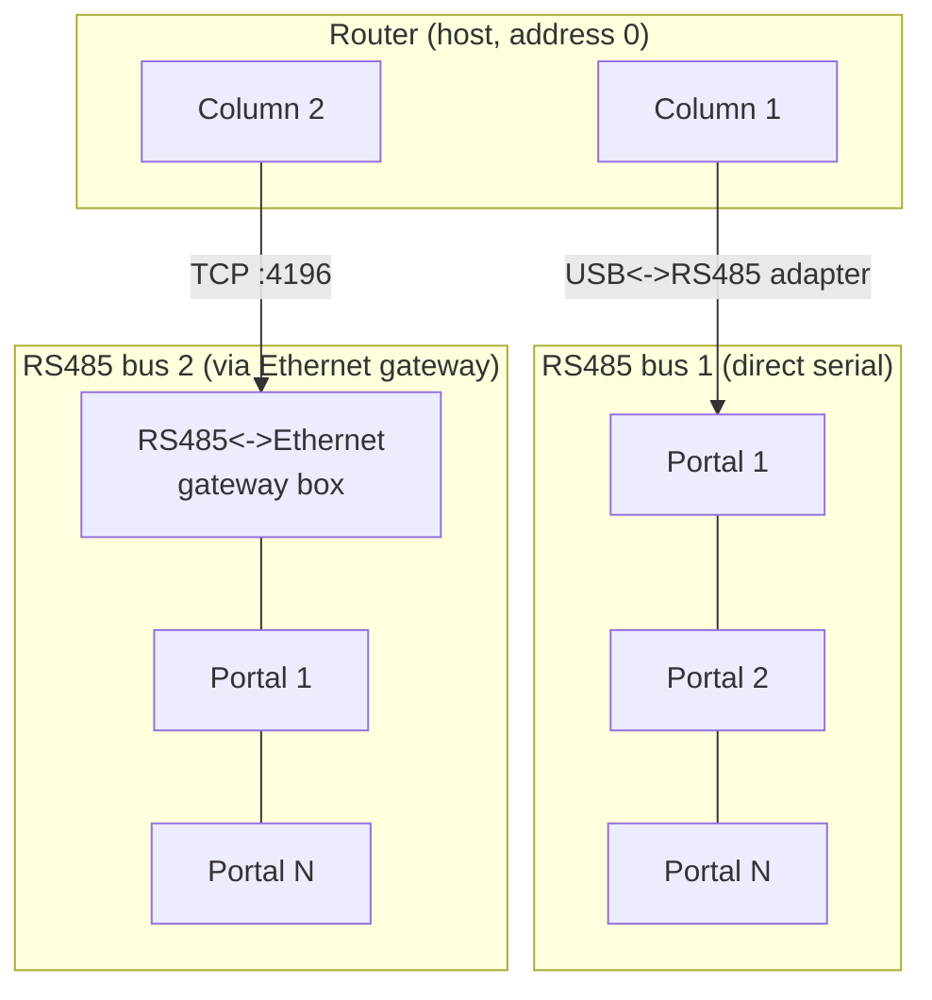
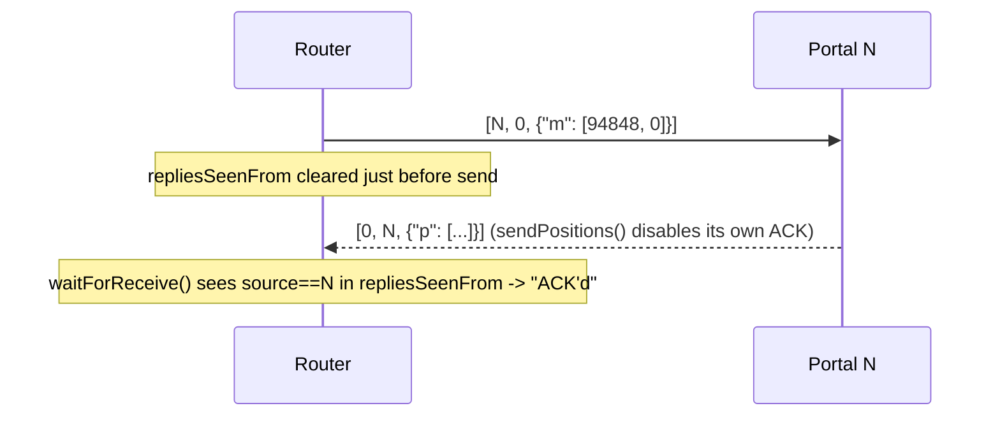
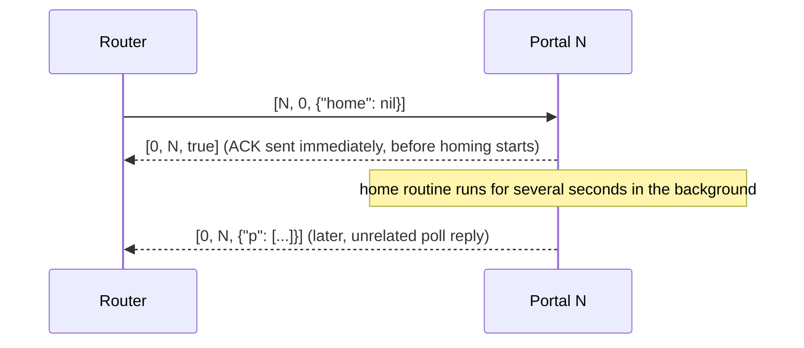
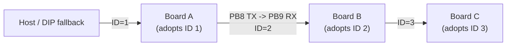
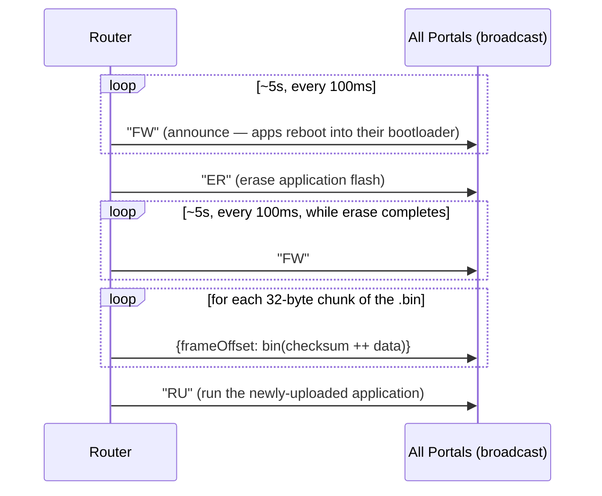

# KC79 Reworld — Communications Protocol

This document describes the wire protocol used between the **Router** (the
openFrameworks/C++ host application, also reimplemented in Rust as
`RouterRS`) and the **Portal** boards (STM32G070 microcontrollers, each
driving two prism-rotation motor axes).

It's written top-down: it starts with the simplest, most user-facing ways
to drive the system on both ends, then progressively zooms into
lower-level detail — the message vocabulary, the reliability contract, the
byte-level wire encoding, the physical bus — ending at the actual `RS485`
class source on both sides. You can stop reading as soon as you have the
level of detail you need; nothing later in the document is required to use
the system at the level described in [§1](#1-quick-start-simple-usage-patterns).

Everything here describes the protocol **as currently implemented**. For a
list of known weaknesses and a proposed hardening plan (CRC, real
sequence-numbered ACKs, retransmission), see
[`protocol-hardening.md`](./protocol-hardening.md). Where relevant this
document notes the specific gap and links back to that plan rather than
repeating it.

Jargon is defined the first time it's used and again in the
[Glossary](#glossary) at the end.

---

## Table of contents

1. [Quick start: simple usage patterns](#1-quick-start-simple-usage-patterns)
2. [System overview](#2-system-overview)
3. [Commands & replies: the message vocabulary](#3-commands--replies-the-message-vocabulary)
4. [Reliability contract: ACKs, timeouts, collation](#4-reliability-contract-acks-timeouts-collation)
5. [Wire format: the MessagePack envelope](#5-wire-format-the-messagepack-envelope)
6. [Wire format: COBS framing](#6-wire-format-cobs-framing)
7. [Physical & electrical layer](#7-physical--electrical-layer)
8. [RS485 over Ethernet (the TCP gateway)](#8-rs485-over-ethernet-the-tcp-gateway)
9. [The ID daisy-chain](#9-the-id-daisy-chain)
10. [Firmware update / bootloader protocol](#10-firmware-update--bootloader-protocol)
11. [Known limitations](#11-known-limitations)
12. [Source map](#12-source-map)
13. [Glossary](#glossary)

---

## 1. Quick start: simple usage patterns

You never need to touch COBS, MessagePack, or the `RS485` class directly to
use this system. Here's what actually gets used day-to-day, from the most
user-facing entry point down to the simplest C++/firmware calls.

(A **Column** is one RS485 bus with Portals `1..N` wired to it; addresses
are explained fully in [§2](#2-system-overview) — you don't need the full
model to follow the examples below.)

### Router side

**Simplest: OSC.** The Router listens for OSC on UDP port 4000 by default
(`Router/src/Modules/OSC/`). Any of the 12 broadcastable actions
(`Portal::getActions()`, `Router/src/Modules/Hardware/Portal.cpp`) can be
triggered by OSC address, at three different scopes — the whole
installation, one Column, or one Portal
(`Router/src/OSC/Routes.cpp:270-313`):

```
/ping                → ping every Portal in every Column
/0/home              → run the home routine on every Portal in Column 0
/0/8/seeThrough      → set Portal 8 in Column 0 to the "see through" position
```

(Column indices are 0-based, like an array index; Portal target IDs are
1-based, since `0` is reserved for the host — see §2.)

The 12 action names are: `ping`, `init`, `calibrate`, `home`, `flashLEDs`,
`goHome`, `seeThrough`, `disableDebugLights`, `enableDebugLights`, `unjam`,
`escapeFromRoutine`, `reboot`. A couple of routes take explicit arguments
instead of being a bare action, e.g. moving a portal to a normalised pilot
position (`Routes.cpp:28-54`):

```
/move <column_id> <portal_id> <x> <y>
```

**Also simple: REST.** A `crow`-based HTTP server (port 8080 by default,
`Router/src/Modules/REST/Server.cpp`) exposes plain GET routes:

```
curl http://localhost:8080/0/8/getPosition
curl http://localhost:8080/0/8/setPosition/0.5,0.0
curl http://localhost:8080/0/8/pollPosition
```

**One level down: the C++ API.** If you're writing Router code directly
(a new GUI button, a test harness, a headless script), you call plain
methods on a `Portal` object — no protocol code in sight:

```cpp
auto portal = column->getPortalByTargetID(8);

portal->ping();               // Portal.cpp:494 — sendToPortal(MsgPack(), "")
portal->poll();                // Portal.cpp:501 — requests a full status report
portal->performAction(action); // trigger any of the 12 actions above
```

None of this builds an envelope, encodes MessagePack, or waits for an ACK
by hand — `sendToPortal()` (§5) builds and queues the message, and a
background thread per Column (§4, §7) takes care of encoding, sending, and
waiting for the reply.

### PortalFW side

**As a firmware developer, you almost never touch the protocol at all.**
The entire top-level loop is this (`PortalFW/src/main.cpp:59-64`):

```cpp
void loop() {
    app.update();
    HAL_Delay(1);
}
```

`App::update()` calls `rs485->update()` once per loop, alongside every
other module (`PortalFW/src/Modules/App.cpp:100`). Incoming frames are
decoded, dispatched to the right handler, and ACKed automatically — all
before any command-handling code you write ever runs.

**To add a brand-new command**, you add one branch to
`App::processIncomingByKey`. This is the entire cost of wiring up a new
command — reading a typed value and reacting to it
(`PortalFW/src/Modules/App.cpp:437-444`):

```cpp
else if (strcmp(key, "debugLightsEnabled") == 0) {
    bool value;
    if(!msgpack::readBool(stream, value)) return false;
    this->leds->setDebugLightsEnabled(value);
    return true;
}
```

No COBS, no framing, no ACK-sending code appears here — once your handler
returns `true`, `RS485::processIncoming()` (§4, §7) sends the ACK for you.

Everything from here on explains what's actually happening underneath
those calls, in progressively lower-level detail.

---

## 2. System overview

A physical installation is divided into **Columns**. Each Column owns exactly
one RS485 bus (or its Ethernet-gateway equivalent — see §8) and a number of
**Portals** — the boards physically wired to that bus, addressed `1..N`.
Address `0` is reserved for the Router itself ("the host"), and address `-1`
means **broadcast** (all Portals on the bus at once).



Every message on the wire — in either direction, on either transport — is
the same shape: a small binary **envelope** `[target, source, body]`,
**serialised** with **MessagePack** (a compact binary encoding, see §5), then
**framed** with **COBS** (Consistent Overhead Byte Stuffing, see §6) so a
receiver reading a raw byte stream off a UART can find message boundaries.
Address resolution, ACK matching, retries (or the current lack of them),
and the actual command semantics all live in a **reliability** layer built
on top of that (§4), which the OSC/REST/C++ calls in §1 sit on top of in
turn.

A separate, physically distinct link — not RS485, not COBS, not
MessagePack — chains the boards together only to hand out sequential
addresses at power-on; see §9.

---

## 3. Commands & replies: the message vocabulary

Every message body is one of the shapes below. This is the vocabulary the
higher-level calls in §1 ultimately produce — how it's actually encoded as
bytes is covered separately in §5.

| Body | Shape | Meaning |
|---|---|---|
| `nil` | bare nil value | **Ping** — elicits a bare ACK, nothing else. |
| a short string, e.g. `"FW"` | bare string | A **magic word** — see §10 (firmware update / reboot-to-bootloader). |
| bare `bool` | bare boolean | **ACK** — success/failure of the previous command. Not wrapped in a map — indistinguishable in shape from any other bare-value body (see §11). |
| `{"p": [a, b, ta, tb]}` | 1-entry map, value = 4 integers | **Position reply** — current position and target position for both axes. |
| `{"app":…, "mca":…, "mcb":…, "logger":…}` | up to 4-entry map | **Full status reply** to a `poll` — app uptime/version/calibration, per-axis motion-control health, recent log messages. |
| `{"poll": nil}` | 1-entry map | Request a full status reply. |
| `{"p": nil}` | 1-entry map | Request just a position reply (cheaper, higher-frequency poll). |
| `{"m": [a, b]}` | 1-entry map, array of 1–2 integers | Move both axes (or just one, if only one element given). |
| `{"motionControlA": {…}}` / `"motionControlB"` | nested map | Per-axis motion commands: `move`, `motionProfile`, `zeroCurrentPosition`, `measureBacklash`, `home`, `initTimer`, `deinitTimer`, `testTimer`. |
| `{"motorDriverA": {…}}` / `"motorDriverB"` | nested map | `testRoutine`, `testTimer`. |
| `{"motorDriverSettings": {…}}` | nested map | `setCurrent` (amps), `setMicrostepResolution` (log2 of the resolution, e.g. 32 → 5). |
| `{"init": …}` / `{"calibrate": …}` / `{"home": …}` / `{"unjam": …}` | value = `nil` (defaults) or array `[timeout_s, slowSpeed, backOffDistance, debounceDistance(, tryCount)]` | Long-running calibration routines — see the early-ACK note in §4. |
| `{"flashLED": …}` | value = `nil` or `[period_us, count]` | Blink the status LED, for physically identifying a board. |
| `{"debugLightsEnabled": bool}` | | Toggle debug LEDs (the handler shown in §1). |
| `{"escapeFromRoutine": nil}` | | Abort whatever long routine is currently running. |
| `{"reset": nil}` | | Reboot the application (not the bootloader — a normal `NVIC_SystemReset()`; contrast with the `"FW"` magic word in §10). |
| `{"keyframe": {"startIndex": n, "values": [...]}}` | nested map, array of `[a,b]` or `[a,b,va,vb]` | Batched pre-computed motion keyframes, broadcast; each device only consumes the slice matching its own ID. |
| `{"homeThreshold": n}` | | Optical home-switch threshold tuning. |

All of the above are dispatched generically: the firmware reads the body as
a map and, for each key, calls a handler looked up by that key name
(`App::processIncomingByKey`, `PortalFW/src/Modules/App.cpp` — see the
`debugLightsEnabled` example in §1). The `"id"` key is currently parsed but
not acted on by anything (`ID` doesn't implement a handler for it) — a stub
for future use, not a bug in current behaviour.

The **firmware-update sub-protocol** layers its own body shapes inside this
same envelope — see §10.

---

## 4. Reliability contract: ACKs, timeouts, collation

Each Column runs a single background thread
(`RS485::serialThreadedFunction`, `Router/src/Modules/Hardware/RS485.cpp:596-628`)
that repeatedly: checks for incoming bytes; if nothing has arrived recently
(`gapAfterLastRx_ms`, default **5 ms** — a settling gap to respect the bus's
half-duplex turnaround), sends the next queued outgoing packet.

### Sending and waiting for an ACK



After transmitting a packet that `needsACK` (the default), the Router waits
up to **`responseWindow_ms`** (default **300 ms**,
`Router/src/Modules/Hardware/RS485.h:128`) for *any* well-formed frame whose
`source` field matches the packet's `target`
(`waitForReceive`, `RS485.cpp:804-829`). If nothing arrives inside the
window, the send is logged as failed (if debug logging is on) — **there is
no retransmission**. If a matching-source frame does arrive, it's treated
as a successful ACK regardless of what its body actually contains — the
ACK's own `true`/`false` payload is never inspected by this matching logic,
and a late status or position reply can just as easily satisfy the wait as
a genuine ACK for that specific command. There is also no sequence number
anywhere in the envelope to correlate a specific reply with the specific
command it answers. All three of these are known gaps with a concrete fix
proposed — see
[Finding 3, protocol-hardening.md](./protocol-hardening.md#finding-3--ack-is-cosmetic-no-correlation-no-retransmission).

**Broadcast** packets (`target == -1`) never expect an ACK at all — both
sides agree on this: the firmware sets `disableACK = true` whenever it sees
target `-1` (`PortalFW/src/Modules/RS485.cpp:240-243`), and the Router's
`Column::broadcast()` sets `needsACK = false` on every packet it builds. A
broadcast is instead followed by a fixed pacing gap,
`gapBetweenBroadcastSends_ms` (default **100 ms**), before the next send is
attempted.

### Early ACK for long routines

`init`, `calibrate`, `home`, and `unjam` can run for seconds — far longer
than the 300 ms response window. To avoid the Router timing out on every
one of these, the firmware sends its ACK **immediately**, before starting
the routine (`RS485::sendACKEarly(true)`, called at the top of each of
those four handlers in `App.cpp`), then runs the (possibly long) routine in
the background. A `sentACKEarly` flag suppresses the normal end-of-message
ACK that would otherwise fire once `processCOBSPacket` returns, so exactly
one ACK is sent per command either way:



### Outbox collation

Before each send cycle, packets queued for the same `(address, target)`
pair are collapsed down to just the most recent one
(`RS485::collateOutboxPackets`, `RS485.cpp:479-525`, on by default). This
means if the GUI issues several rapid move commands to the same Portal
faster than the bus can drain them, only the latest target position is
ever actually sent — stale, superseded motion commands are silently
dropped rather than queuing up and executing out of order. Non-collateable
traffic (keyframe batches, firmware-upload frames) is exempt and always
sent in full.

---

## 5. Wire format: the MessagePack envelope

**MessagePack** is a compact binary serialisation format — think "JSON, but
each value is tagged with a type byte and packed to its minimal binary
representation" rather than printed as text. A small integer costs one
byte; a short string costs a length byte plus its bytes; there's no comma,
colon, or quote-character overhead. Type tags actually seen in this
protocol:

| Tag byte(s) | Meaning |
|---|---|
| `0x00`–`0x7F` | positive fixint (0–127) |
| `0xE0`–`0xFF` | negative fixint (-32 to -1); e.g. `0xFF` = -1 |
| `0x80`–`0x8F` | fixmap (0–15 entries) |
| `0x90`–`0x9F` | fixarray (0–15 entries) |
| `0xA0`–`0xBF` | fixstr (0–31 bytes), length encoded in the low bits |
| `0xC0` | nil |
| `0xC2` / `0xC3` | bool false / true |
| `0xC4` / `0xC5` | bin8 / bin16 (length-prefixed raw bytes) |
| `0xCA` | float32 |
| `0xCD` | uint16 |
| `0xCE` | uint32 |
| `0xD0` | int8 (used specifically for envelope addresses, see below) |
| `0xD2` | int32 |

### The envelope

Every message — command, reply, ping, or magic word — is a 3-element
**fixarray**: `[target, source, body]`.

- `target` (int): `0` = host/router, `1`–`127` = a specific Portal,
  `-1` = broadcast to all Portals on this Column's bus.
- `source` (int): who sent it (`0` from the Router; the sending Portal's
  own ID otherwise).
- `body`: the payload — the vocabulary catalogued in §3.

There are, in practice, **two different ways** the address pair gets
encoded, and both are accepted on decode:

1. **Minimal-int encoding** (`msgpack11`, used by most Router → Portal
   traffic, e.g. `Portal::sendToPortal`): addresses are packed to their
   smallest representation — a small positive target like `8` is a single
   positive-fixint byte `08`; `-1` is a single negative-fixint byte `FF`.
2. **Forced int8 encoding** (`msgpack-c`, used by `RS485::makeHeader` and
   the firmware-update path): addresses are *always* packed as a 2-byte
   `int8` (`0xD0` tag + value byte), e.g. target `-1` is `D0 FF`, not `FF`.

Firmware replies use yet another encoder (msgpack-arduino's
`writeInt8`/`writeIntU7`), which again may differ byte-for-byte from either
of the above. None of this matters to a receiver: every decoder in this
project only requires the envelope to be *an array of at least 3 elements*
whose first two elements are integers of any width — extra trailing
elements are tolerated and ignored (this tolerance is deliberately relied
upon for forward-compatible protocol extension; see
[protocol-hardening.md §3](./protocol-hardening.md#3-proposed-end-state-wire-format)).

### Worked example: a broadcast poll

The Router asking every device to send a full status report is the body
`{"poll": nil}` addressed to target `-1` (broadcast), source `0` (host).
MessagePack-encoding just the body:

```
81 A4 70 6F 6C 6C C0
│  │  └────┬────┘ └── C0 = nil
│  └─ A4 = fixstr, length 4 → "poll" (70 6F 6C 6C = ASCII p o l l)
└──── 81 = fixmap, 1 entry
```

Wrapped in the 3-element envelope `[-1, 0, body]`:

```
93 FF 00 81 A4 70 6F 6C 6C C0
│  │  │  └──────────┬───────┘
│  │  └─ 00 = positive fixint 0  (source = host)
│  └──── FF = negative fixint -1 (target = broadcast)
└─────── 93 = fixarray, 3 elements
```

This 10-byte plaintext is what §6 turns into an actual wire frame.

### Worked example: a unicast move command

Body `{"m": [94848, 0]}` (move Portal 8's axis A to position 94848, axis B
to 0), addressed unicast:

```
Body:      81 A1 6D 92 CE 00 01 72 80 00
           │  │  │  │  └─────┬─────┘ └── 00 = fixint 0 (axis B target)
           │  │  │  └─────── CE = uint32 tag, value 94848 (axis A target)
           │  │  └────────── 92 = fixarray, 2 elements
           │  └───────────── A1 = fixstr length 1 → "m" (6D = ASCII 'm')
           └──────────────── 81 = fixmap, 1 entry

Envelope:  93 08 00 81 A1 6D 92 CE 00 01 72 80 00
           │  │  └── 00 = source (host)
           │  └───── 08 = target (Portal 8, positive fixint)
           └──────── 93 = fixarray, 3 elements
```

(matches `RouterRS/crates/router-proto/src/envelope.rs::unicast_move_frame_bytes`)

Both worked examples above are verified against the codec's own test
suite; §6 picks them back up and shows exactly what goes out on the wire.

---

## 6. Wire format: COBS framing

A UART is just a stream of bytes — it has no concept of "here's where one
message ends and the next begins." Something has to mark frame boundaries.
The obvious choice — a delimiter byte, e.g. `0x00` — only works if you can
guarantee that byte never occurs *inside* a frame's actual data. Since a
MessagePack-encoded body can legitimately contain `0x00` bytes (e.g. the
integer 0, or a null/`nil` value — as both worked examples in §5 do), we
need a way to remove all zero bytes from a message before sending it, in a
way a receiver can perfectly reverse.

**COBS (Consistent Overhead Byte Stuffing)** solves exactly this. It
transforms an arbitrary byte string into an equivalent one that is
guaranteed to contain **no zero bytes**, at a small, bounded overhead cost
(at most 1 extra byte per 254 input bytes). A single `0x00` byte can then be
appended as an unambiguous end-of-frame marker, and a receiver can always
find frame boundaries by scanning for `0x00`, and can safely resynchronise
after any corruption by just looking for the next one.

**The algorithm**, in short: scan the data for the position of each zero
byte. Replace each zero byte with a length code — the number of bytes until
the next zero (or end of data), plus one — so a decoder can reconstruct
where each zero *was* without that zero ever appearing on the wire. A
minimal worked example, straight from the vendored codec's own test
vectors (`Router/src/cobs-c/`, ported byte-for-byte in
`RouterRS/crates/router-proto/src/cobs.rs`):

```
input:   11 22 00 33
step 1:  find the zero at index 2. Bytes before it: 11 22 (2 bytes) →
         code = 2 + 1 = 03
step 2:  bytes after the zero to end-of-data: 33 (1 byte) →
         code = 1 + 1 = 02
encoded: 03 11 22 02 33
```

On this project's wire, a **frame** is: COBS-encoded MessagePack bytes,
followed by a single literal `0x00` delimiter
(`Router/src/Modules/Hardware/RS485.cpp:741-756`,
`PortalFW/lib/msgpack-arduino/.../COBSRWStream.cpp`). `0x00` is the *only*
byte with special meaning on the wire — everything else, including what
were originally zero bytes in the payload, has been transformed away.

### Worked example, continued: the broadcast poll

Taking the 10-byte plaintext from §5 (`93 FF 00 81 A4 70 6F 6C 6C C0`),
which contains exactly one zero byte (the source, at index 2):

```
plaintext:  93 FF 00 81 A4 70 6F 6C 6C C0
                    ^^ the one zero byte

before the zero: 93 FF        (2 bytes) → code 03
after the zero:  81 A4 70 6F 6C 6C C0  (7 bytes, end of data) → code 08

COBS-encoded: 03 93 FF 08 81 A4 70 6F 6C 6C C0
append EOP:   03 93 FF 08 81 A4 70 6F 6C 6C C0 00
```

That 12-byte sequence is exactly what goes out on the wire (verified
against the codec's own test suite,
`RouterRS/crates/router-proto/src/envelope.rs::broadcast_poll_frame_bytes`).
A receiver reads bytes until it sees `0x00`, hands everything before it
(`03 93 FF 08 81 A4 70 6F 6C 6C C0`) to the COBS decoder, and gets back the
original 10-byte plaintext.

The unicast-move envelope from §5 (13 bytes, with *two* embedded zero
bytes: the fixint `00` for axis B, and the high byte of `94848`) encodes to
`03 93 08 06 81 A1 6D 92 CE 04 01 72 80 01 00` — the same mechanism,
handling multiple zero bytes without any special-casing.

### On the receiving end

Both ends implement the mirror-image accumulate-until-zero logic:

- **Router** (`RS485::serialThreadReceive`,
  `Router/src/Modules/Hardware/RS485.cpp:631-711`): appends incoming bytes
  to a buffer; on a `0x00` byte, COBS-decodes the accumulated buffer, then
  MessagePack-decodes the result.
- **Firmware** (`COBSRWStream`,
  `PortalFW/lib/msgpack-arduino/src/msgpack/COBSRWStream.cpp`): this side is
  **streaming** rather than batch — it decodes bytes into a 256-byte ring
  buffer (`MSGPACK_COBSRWSTREAM_BUFFER_SIZE`,
  `COBSRWStream.hpp:4`) as they arrive, and the msgpack reader can start
  consuming fields before the frame's closing `0x00` has even been seen.
  This has a real consequence for data-integrity hardening — see
  [Finding 2 in protocol-hardening.md](./protocol-hardening.md#finding-2--no-payload-integrity-corruption-risk).

A **real captured frame** (a position report from device 1 to the host,
`[0, 1, {"p": [94848, 0, 94848, 0]}]`, position value `94848` = half a
prism rotation) demonstrates COBS handling of a payload with several
embedded zero bytes transparently:

```
03 93 D0 08 D0 01 81 A1 70 94 D2 05 01 72 80 D2 01 01 01 02 D2 05 01 72 80 D2 01 01 01 01 00
```

— which decodes, via the same procedure, to target `0` (host), source `1`
(Portal 1), body `{"p": [94848, 0, 94848, 0]}` (the position-reply shape
from §3).

---

## 7. Physical & electrical layer

**RS485** is a differential, multi-drop serial bus: two wires per pair
(commonly labelled **A** and **B**), plus a shared ground, connecting every
node on the bus. Being differential (the signal is the *voltage difference*
between A and B, not either wire's voltage relative to ground) makes it far
more resistant to electrical noise over long cable runs than a single-ended
bus like plain UART/RS232. Because all nodes share the same pair of wires,
RS485 is **half-duplex**: only one node may drive (transmit on) the bus at
any instant, or the signals collide. A bus like this is normally
**daisy-chained** node-to-node and terminated with a resistor at each
physical end of the cable run to prevent signal reflections; this project's
own bench-test notes call for "A/B/GND in a daisy-chain with proper
termination at the bus ends" — this is a physical/installation concern, not
something configured in software.

Underneath RS485 sits a plain **UART** (Universal Asynchronous
Receiver/Transmitter — the same kind of serial hardware used for RS232 or a
USB-serial adapter). Both ends run at:

- **Baud rate:** 115,200 (`Router/src/SerialDevices/Serial.h:5`,
  `PortalFW/src/Modules/RS485.cpp:58`)
- **Framing:** 8 data bits, no parity, 1 stop bit ("**8N1**") — the default
  for `HardwareSerial`/`ofSerial`; neither codebase configures parity or
  stop bits explicitly. No parity means single-bit-flip corruption is not
  detected at the UART level at all (see §11).

Because RS485 is half-duplex, each Portal must actively switch its
transceiver between "transmit" and "receive" mode — it cannot listen while
driving the bus. This is done with a **DE (Driver Enable) pin**: held LOW
the transceiver listens, held HIGH it drives. On the Portal board this is
GPIO `PA1` (`PortalFW/src/Modules/RS485.cpp:35`), toggled directly around
each transmission — this is the actual `RS485` class implementation this
whole document has been building up to:

```cpp
// PortalFW/src/Modules/RS485.cpp
void RS485::beginTransmission() { digitalWrite(PIN_DE, HIGH); }
void RS485::endTransmission()   { cobsStream.flush(); digitalWrite(PIN_DE, LOW); }
```

DE is raised before the first byte is written and only dropped back to
receive-mode *after* `flush()` has pushed every byte — including the
trailing COBS delimiter — out through the UART, so the bus is never
released mid-frame.

The Router side has **no DE-pin logic anywhere in software** — neither the
direct-serial transport (`Router/src/SerialDevices/Serial.cpp`) nor the TCP
gateway transport (§8) toggles a direction pin. This means the USB↔RS485
adapter (direct-serial case) or the physical RS485↔Ethernet gateway box
(TCP case) is relied upon to manage the electrical turnaround itself,
transparently to the application.

### Pin summary (Portal board, STM32G070RBT6)

| Signal | Pin | Peripheral | Notes |
|---|---|---|---|
| RS485 TX | PA2 | USART2 | |
| RS485 RX | PA3 | USART2 | |
| RS485 DE | PA1 | GPIO | HIGH = transmit, LOW = receive |
| ID chain TX | PB8 | USART3 | separate bus, see §9 |
| ID chain RX | PB9 | USART3 | separate bus, see §9 |
| ID DIP switches | PD0–PD3 | GPIO, `INPUT_PULLUP` | fallback address, see §9 |

(Full pin map: `PortalFW/pins.md`.)

---

## 8. RS485 over Ethernet (the TCP gateway)

Some Columns reach their Portals not through a directly-attached USB↔RS485
adapter but through a **hardware RS485↔Ethernet gateway** — a small
external box that bridges a TCP socket to an RS485 differential pair
electrically. The Router talks to it as a plain TCP client
(`Router/src/SerialDevices/TCP.cpp`), on **port 4196** by default
(`TCP_DEFAULT_PORT`, `TCP.h:7`), with a 1-second connect timeout by default.
Two example gateway addresses are hardcoded as GUI quick-picks,
`192.168.1.201` and `192.168.1.202` (`TCP.cpp:124,142` — one per Column, in
practice), alongside a "Custom…" option for any `host:port`. No
vendor/model is named anywhere in the repository; only the port number and
those two example addresses hint that this is a typical industrial
serial-to-Ethernet bridge on a private LAN segment.

Both transports — direct serial and TCP — implement the same small
interface (`Router/src/SerialDevices/IDevice.h`):

```cpp
class IDevice {
public:
    virtual size_t transmit(const Buffer&) = 0;
    virtual bool   hasDataIncoming() = 0;
    virtual Buffer receiveBytes() = 0;
    // ...
};
```

Crucially, **the TCP path adds no framing of its own**. `TCP::transmit`
(`TCP.cpp:76-86`) calls `tcpClient.sendRawBytes(...)` on the buffer it's
given — which is already the fully COBS-encoded byte sequence, built
upstream by `RS485::serialThreadSend` exactly as for direct serial (§6).
`TCP::receiveBytes` (`TCP.cpp:96-110`) reads up to 256 raw bytes per call
and hands them back as-is; they may be a partial COBS frame, and are fed
into the same `cobsIncoming` accumulator used for the serial path.

In other words: **RS485-over-Ethernet, here, means "the same COBS/MessagePack
byte stream, tunnelled unmodified through a raw TCP socket to a hardware
gateway that re-emits it electrically as RS485."** TCP's own
ordering/retransmission guarantees mean bytes arrive complete and in order
across the network hop, but this only protects the Ethernet segment — the
RS485 segment on the far side of the gateway is exactly as reliable (or
unreliable) as the direct-serial case, since it's the identical protocol
running through it. The 300 ms response window, lack of sequence numbers,
etc. (§4) are unaffected by which transport a Column uses; the gateway is
invisible to everything above the `IDevice` abstraction.

---

## 9. The ID daisy-chain

Portal boards don't get their bus address from a central registry; the
address is derived by chaining boards together on a **separate,
point-to-point serial link** — not RS485, not COBS, not MessagePack — using
USART3 on pins `PB8` (TX) → `PB9` (RX). Board *N*'s TX physically wires to
board *N+1*'s RX, so the chain propagates address `N` down to address
`N+1`, one hop at a time:



**Wire format**, 5 bytes per message, terminated by a literal `0x00` (this
terminator is a bespoke framing scheme for this link only — it is *not*
COBS):

```
[ ID, 'C' XOR ID, 'R' XOR ID, 'C' XOR ID, 0x00 ]
```

Sent by every board once per second, or immediately whenever its own ID
changes (`ID::sendIDToNext`, `PortalFW/src/Modules/ID.cpp:140-149`):

```cpp
serialID.write(this->value);
serialID.write('C' ^ this->value);
serialID.write('R' ^ this->value);
serialID.write('C' ^ this->value);
serialID.write(0);
```

On receipt, a board buffers the last 4 non-zero bytes seen, and on a `0x00`
terminator with exactly 4 bytes buffered, checks the pattern and — if
it "matches" — adopts `receivedID + 1` as its own address
(`ID::readIncomingID`, `ID.cpp:106-137`), then forwards *its own new value*
(not the raw bytes it received) on to the next board. This is how "ID + 1,
forward" propagates down a chain: each board's outgoing message always
carries whatever it currently believes its own address to be.

If no valid signal is ever received on this chain, each board falls back to
a 4-bit binary value read from DIP switches `PD0`–`PD3` (active-low,
`INPUT_PULLUP`), offset by 1 so that all-switches-off maps to ID 1 (ID 0
is reserved for the host) — giving addresses 1–16 without the chain.

> **Note:** the checksum comparison in the current firmware has an
> operator-precedence bug (`^` binds looser than `==` in C++, so the
> intended `(targetID ^ 'C') == byte` check doesn't parse the way it reads)
> which means it accepts almost any 4-byte/terminator sequence rather than
> genuinely validating it, and the 4-byte receive buffer is never
> explicitly cleared after use. Both are called out with fixes in
> [protocol-hardening.md, Findings 1 & 5](./protocol-hardening.md#finding-1--id-daisy-chain-checksum-is-silently-disabled-correctness-bug).
> This document describes the mechanism as designed/implemented; it is not
> a description of the fix.

---

## 10. Firmware update / bootloader protocol

Firmware updates are broadcast-only (`target = -1`) and use the same
envelope/COBS framing as everything else, but with three special
2-character **magic-word** bodies and a distinct upload-frame body shape.
None of this traffic expects an ACK.



**Magic words** (`FwMagic` / `FWUpdate::sendMagicWord`,
`Router/src/Modules/Hardware/FWUpdate.cpp:214-274`) are a bare 2-byte
MessagePack `fixstr` body:

| Word | Bytes | Meaning |
|---|---|---|
| `"FW"` | `A2 46 57` | Announce — the running application resets into its bootloader (`NVIC_SystemReset()` after a short log message, `PortalFW/src/Modules/RS485.cpp:265-279`). The bootloader itself also treats this word as "reset upload progress," so it's re-sent throughout erase/upload to keep every board — whether already in the bootloader or not — in a known state. |
| `"ER"` | `A2 45 52` | Erase application flash (bootloader-only; the application doesn't act on this word). |
| `"RU"` | `A2 52 55` | Run the newly-flashed application. |

Full envelope bytes for `"FW"` (using the forced-int8 header style this
path uses): `93 D0 FF D0 00 A2 46 57`.

**Upload frames** carry the firmware binary in fixed-size chunks (32 bytes
by default, `FW_FRAME_SIZE`), each wrapped as a 1-entry map keyed by byte
offset, value a MessagePack `bin` blob of `checksum (2 bytes, little-endian)
++ data`:

```
{ frameOffset(uint32) : bin( checksum_le(u16) ‖ raw_data ) }
```

The checksum is a simple XOR of every 16-bit little-endian word in the
chunk (`Utils::calcCheckSum`, `Router/src/Utils.cpp:176-188`) — this is a
**payload-only** integrity check for the firmware image being uploaded; it
has nothing to do with, and offers no protection for, ordinary
command/status/ACK traffic (see §11). Example, for a 32-byte all-`0xAA`
chunk at offset 64:

```
93 D0 FF D0 00                  -- [-1, 0, ...] envelope (broadcast, forced-int8)
81 40                            -- fixmap(1), key = 64 (fixint)
C4 22                            -- bin8, length 34 (2 checksum + 32 data)
00 00                            -- checksum: 16× 0xAAAA XORed together = 0 (even count)
AA AA AA ... (32 bytes)          -- the data itself
```

By default each chunk is transmitted once, with a 5 ms pacing gap between
frames (`waitBetweenFrames`); both are configurable, along with a
frame-repetition count, for noisier buses. Trailing `0xFF` padding bytes in
the source `.bin` are trimmed before upload by default.

---

## 11. Known limitations

This section is intentionally brief — the full analysis, proposed fixes,
and a bench-test plan live in
[`protocol-hardening.md`](./protocol-hardening.md). In summary, as of this
writing:

- **No per-frame integrity check.** COBS only frames; MessagePack only
  validates structure. A single bit-flip inside, say, a motion target can
  decode as a perfectly valid — but wrong — command. There is no parity,
  checksum, or CRC on ordinary traffic (the XOR checksum in §10 covers only
  firmware-upload payloads).
- **ACKs are not truly correlated.** Any frame from the expected sender
  within the response window counts as "the ACK," regardless of its actual
  content, and there's no sequence number to distinguish a reply to
  command *N* from a reply to command *N+1*.
- **No retransmission.** A timed-out send is only logged, never retried.
- **The ID daisy-chain checksum doesn't actually check anything**, due to
  a C++ operator-precedence bug (§9).

None of these affect how to *read* this document — they describe gaps in
an otherwise fully-functional, currently-deployed protocol, not
discrepancies between this document and the code.

---

## 12. Source map

This is the bottom of the zoom: every file that actually implements what's
described above, from the highest-level entry points down to the `RS485`
class itself on both sides.

| Concern | File(s) |
|---|---|
| Router network-facing entry points (OSC, REST) | `Router/src/OSC/Routes.cpp`, `Router/src/Modules/REST/Server.cpp` |
| Router per-Column/per-Portal API, actions, keyframes | `Router/src/Modules/Hardware/Column.cpp`, `Portal.cpp` |
| **Router `RS485` class** — transport, framing, send/receive, ACK/timeout | `Router/src/Modules/Hardware/RS485.cpp`, `.h` |
| Router serial/TCP transport abstraction | `Router/src/SerialDevices/IDevice.h`, `Serial.cpp`/`.h`, `TCP.cpp`/`.h` |
| Router COBS codec | `Router/src/cobs-c/` |
| Router firmware upload | `Router/src/Modules/Hardware/FWUpdate.cpp`, `MassFWUdpdate.cpp`, `Utils.cpp` (checksum) |
| Firmware top-level loop | `PortalFW/src/main.cpp` |
| Firmware command handlers | `PortalFW/src/Modules/App.cpp` |
| **Firmware `RS485` class** — framing, dispatch, DE-pin control | `PortalFW/src/Modules/RS485.cpp`, `.h` |
| Firmware ID daisy-chain | `PortalFW/src/Modules/ID.cpp`, `.h` |
| Firmware COBS + MessagePack stream (submodule) | `PortalFW/lib/msgpack-arduino/src/msgpack/` |
| Clean, tested Rust reference implementation (byte-compatible) | `RouterRS/crates/router-proto/src/` (`cobs.rs`, `envelope.rs`, `commands.rs`, `replies.rs`, `fw.rs`, `constants.rs`) |
| Full pin map | `PortalFW/pins.md` |
| Hardening plan / bench test procedures | `protocol-hardening.md` |

---

## Glossary

- **RS485** — a differential, multi-drop, half-duplex serial bus standard,
  used here for the bus connecting the Router to every Portal on a Column.
- **Differential signalling** — encoding a signal as the voltage
  *difference* between two wires (A/B) rather than one wire's voltage
  relative to ground; much more resistant to electrical noise.
- **Half-duplex** — only one party on a shared bus may transmit at a time;
  contrast with *full-duplex*, where both directions can be active
  simultaneously (e.g. separate TX/RX wires).
- **DE pin (Driver Enable)** — the GPIO that switches an RS485 transceiver
  between drive (transmit) and listen (receive) mode.
- **UART** (Universal Asynchronous Receiver/Transmitter) — the basic serial
  hardware that sends/receives a byte stream one bit at a time, without
  higher-level framing of its own.
- **Baud rate** — bits transmitted per second on the physical line (here,
  115,200).
- **8N1** — a UART framing convention: 8 data bits, No parity bit, 1 stop
  bit.
- **Daisy-chain** — connecting devices in a series (A→B→C…) rather than
  each independently to a hub.
- **Termination (resistor)** — a resistor placed at each physical end of a
  bus cable to absorb signal energy and prevent reflections that would
  otherwise corrupt data on longer runs.
- **COBS** (Consistent Overhead Byte Stuffing) — an encoding that removes
  all zero bytes from a message (replacing them with length codes) so a
  single `0x00` can be used, unambiguously, as a frame delimiter.
- **Framing** — the general problem of marking where one message ends and
  the next begins within a continuous byte stream.
- **MessagePack** — a compact binary serialisation format, comparable to
  JSON but with type-tagged binary values instead of printed text.
- **Envelope** — this project's fixed 3-element `[target, source, body]`
  wrapper around every message.
- **Fixarray / fixmap / fixstr / fixint** — MessagePack's compact encodings
  for small arrays, maps, strings, and integers respectively, where the
  type tag byte itself also encodes a small length/value.
- **Broadcast** — a message addressed to every device on the bus at once
  (`target == -1` here), as opposed to *unicast* (one specific device).
- **OSC** (Open Sound Control) — a simple, address-based network message
  protocol (originally for musical/media control) used here as one of the
  Router's external control interfaces.
- **REST** — an HTTP-based API style; here, plain GET requests to the
  Router's `crow`-based HTTP server.
- **ACK** (acknowledgement) — a reply confirming a message was received
  (and, ideally, successfully acted on).
- **NACK** (negative acknowledgement) — a reply explicitly reporting
  failure, as opposed to just staying silent.
- **Timeout** — giving up waiting for a reply after a fixed duration
  (here, `responseWindow_ms`, default 300 ms) when no ACK arrives.
- **Retransmission** — resending a message after a timeout, in the hope it
  arrives (or is acted on) this time. **Not currently implemented** in this
  protocol (see §11).
- **Sequence number** — a per-message counter that lets a reply be matched
  to the exact command it's answering, distinguishing it from a reply to
  any other command. **Not currently present** in this protocol's envelope.
- **Checksum** — a value computed from a block of data (here, a simple XOR
  of 16-bit words) that a receiver can recompute and compare, to detect
  (not correct) certain kinds of corruption. Weaker than a CRC.
- **CRC** (Cyclic Redundancy Check) — a stronger class of checksum,
  proposed (not yet implemented) for whole-frame integrity checking; see
  `protocol-hardening.md`.
- **Collation** — here, discarding all but the most recent queued command
  for a given destination/command-type pair before sending, so stale
  commands don't pile up and execute out of order.
- **Daisy-chain ID assignment** — this project's scheme for handing out bus
  addresses by chaining boards together on a dedicated serial link and
  having each board adopt "the ID it received, plus one."
- **Gateway (RS485↔Ethernet)** — a hardware box that bridges a TCP/IP
  network connection to a physical RS485 bus, so a host without a direct
  serial adapter can still reach the bus over Ethernet.
